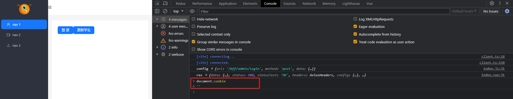

# 1： 浏览器知识📕

## cookie与浏览器本地存储的区别？🎄

**1.1 本质区别**

`cookie`是存储在浏览器的一种存储数据方式，它与  `locaStorage`和 `sessionStorage`存储不同，cookie 会自动将数据发送到服务端，而两者不会自动将数据传输到服务端 ，`cookie`的数据存储上限制每个网站存储大小为4kb，而本地存储的大小可以达到MB级别。

**1.2 ： 安全区别**

从安全的角度上来说，`cookie`的安全系数会比本地存储系数要高，当 服务端将 `cookie` 设置为 HTTPOnly ： true时，浏览器是无法获取到`cookie`的信息的

## 跨域，以及解决方案🎆

### 什么是跨域

当访问服务器时资源时，如果你的 `协议`，`端口`，`ip域名`三者只要有一个出现不一致的情况下，就会产生跨域，这种跨域的问题是出现在浏览器的本身，如果脱离了浏览器环境也就不会再有跨域的问题，例如我们服务器与服务器之间通信就不会产生跨域的问题。

### 解决跨域

**1： 传统方案**

 使用`JSONP`进行处理，动态的创建script 将资源路径放入到  `scropt` src属性上然后发出一个get请求到服务器，服务器通过一个函数名称将值传入，客户端调用函数获得数据。

**2：使用proxy代理**

使用代理设置解决跨域问题，由本地服务代理转发到服务器，然后本地服务接收到响应数据消息后，转交给浏览器

**3 ： cors（Cross-Origin Resource Sharing）解决**

由 服务器端  `cros`（Cross-Origin Resource Sharing）设置允许跨域，所有资源可以访问。你可以在响应头中添加该属性

~~~json
access-control-allow-origin ： *
or
access-control-allow-origin ： 被允许的地址
~~~

## session的原理🖼

session是服务端的一个数据存储，它通常表现为一个`table`，与之对应的值为 uuid ： value，它是一种key value的组合形式存在的，通常uuid是唯一的一个值，它是存储在内存当中的，如果你重启服务它将会消失，此类数据只能通过服务端进行修改，客户端无法进行session的操作。

## cookie的原理🎃

[官方文档](https://developer.mozilla.org/zh-CN/docs/Web/HTTP/Cookies)

### 概述

cookie是客户端的一种数据存储的表现形式，它可以根据浏览器的数据信息自动传输到服务器，而不需要手动传输，通常cookie会在请求头中，服务端也可以设置响应头以传输cookie信息。

### cookie 的生命周期

`cookie`的生命周期一般是有服务端进行设置 `Expires` 指定的日期，或者 `max-Age`指定的一段时间后被删除。

🚩 `cookie`是无法直接被删除的，你只能通过设置它的过期时间，等到下一次响应或者请求时，它就会自动消失。

### cookie的安全发送

cookie中提供了两种安全策略机制进行处理。

**1** ： `secure`属性

它只允许你的请求地址必须是https的类型，如果不是https则 `cookie`  无效。

2 ： `httpOnly`

它决定你的cookie在客户端是否可以通过js脚本获取cookie信息，它传入的是一个boolean值。

**示例**

以下代码中，我们登录成功后，将cookie设置了它的属性，其实 `httpOnly`为 true，则代表客户端在获取cookie时是无法获取的。

~~~js
async function adminLogin  (req , res) {
    res.cookie
    const { loginId , loginPwd } = req.body // 获取请求体的数据
    const result = await AdminService.login({ loginId , loginPwd })
    if(result.code === 1){
        let value = encrypt(result.data.toString())
        res.cookie("token" , value, {
            maxAge : 7 * 24 * 3600 * 1000, // 毫秒数
            httpOnly : true,
            path : '/',
            domain : 'localhost',
        })
        res.setHeader("authorization" , loginId)
        //  登录成功后 保存用户的sessionUserId //
        req.session.sessionUserId = result.data
    }
    res.send(result)
}

~~~

### cookie的域（domain）

`cookie`的 `domain`属性 可以确认cookie可以发送给哪些网站，也就是可以理解为网站作用域。

`domain` 指定哪些主机可以接收服务端发送的cookie，（如果不指定 默认为 主机(`host`)，不包含子域名），`（`

如果你指定了 `domain` 则一般会包含子域名，并且子域名会共享该cookie数据`）`

**例如**，如果设置 `Domain=mozilla.org`，则 Cookie 也包含在子域名中（如 `developer.mozilla.org`）。

### cookie的path

`Path` 属性指定了一个 URL 路径，该 URL 路径必须存在于请求的 URL 中，以便发送 `Cookie` 标头，子路径也会被匹配