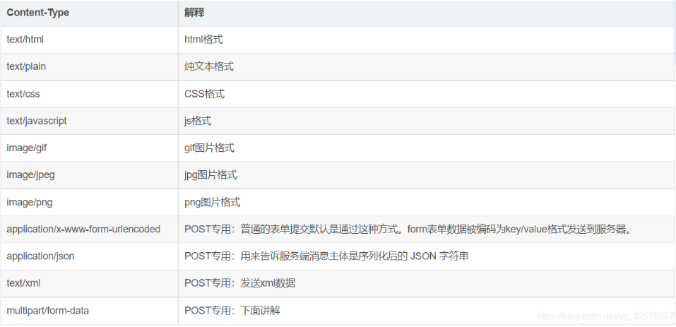
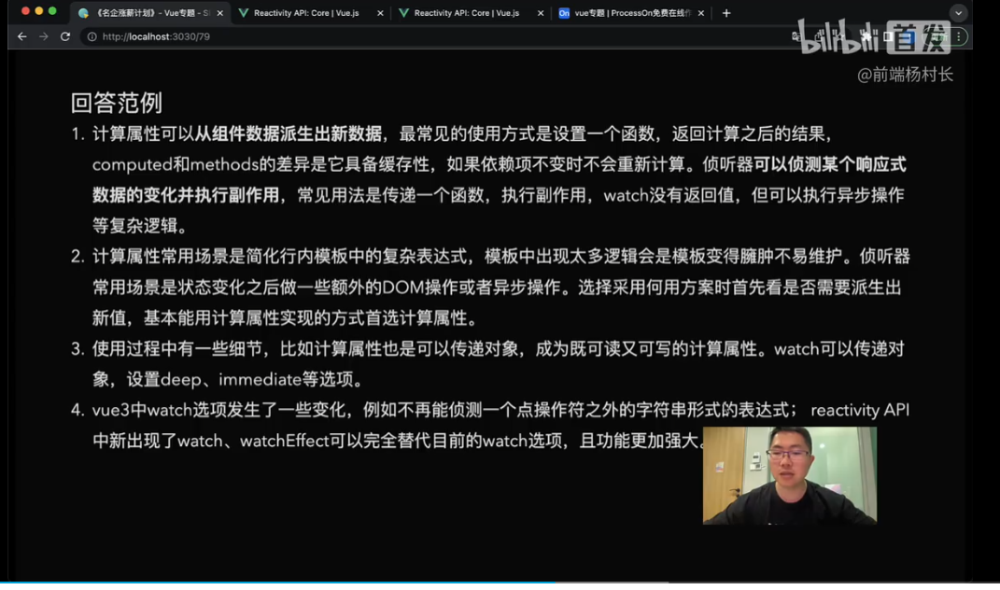
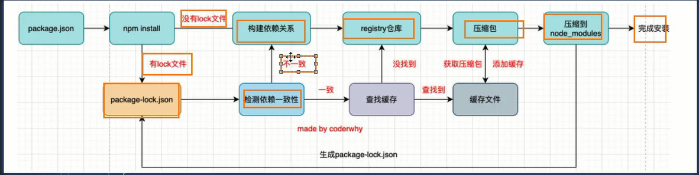

## 课外拓展题

### Css 背景图 等比例缩放区别？

~~~CSS
//图片背景  设置等比列 缩放 background-size：cover 
// img 标签设置 等比例缩放 用 object-fit: Cover 属性 ;
// contain 属性缩放到 与容器大小一致 
~~~


### JavaScript 执行机制 

JavaScript 是一门单线程

语言 ， 由于Dom 的产生页面无法执行多线程，JavaScript 语言 由上到下有序进行执行 

JavaScript语言的一大特点就是单线程，也就是说，同一个时间只能做一件事。那么，为什么JavaScript不能有多个线程呢？这样能提高效率啊。
　　JavaScript的单线程，与它的用途有关。作为浏览器脚本语言，JavaScript的主要用途是与用户互动，以及操作DOM。这决定了它只能是单线程，否则会带来很复杂的同步问题。比如，假定JavaScript同时有两个线程，一个线程在某个DOM节点上添加内容，另一个线程删除了这个节点，这时浏览器应该以哪个线程为准？
　　所以，为了避免复杂性，从一诞生，JavaScript就是单线程，这已经成了这门语言的核心特征，将来也不会改变。
　　为了利用多核CPU的计算能力，HTML5提出Web Worker标准，允许JavaScript脚本创建多个线程，但是子线程完全受主线程控制，且不得操作DOM。所以，这个新标准并没有改变JavaScript单线程的本质


## chrome webkit内核的组成？

>**webKit** : webCore + javascriptCore 组成
>
>webCore  ：负责渲染
>
>JavaScriptCore ：负责解析JS

## DOM的渲染过程？

>1：发起网络请求，获取对应的资源文件
>
>2：解析HTML，每个节点有自己的序列化标记的 token ， 解析完成 生成DOM树 
>
>3：解析CSS， 生成 Css 树 
>
>4：遇见 script 标签调用 JS引擎 进行js 绑定时间 ，修改css 等操作
>
>5：将 DOM树 和 CSS 树 合并生成 一个 渲染(render)树
>
>​	浏览器解析 图片资源，每次解析64Kb ,边请求边解析，最后请求完成后 直接解析渲染
>
>​	style标签里的样式 由 HTML解析器进行解析
>
>​	link 标签样式解析是同步的 


## 什么是重绘，什么是回流？

>重绘：对盒子的颜色，透明度，字体颜色，重新绘制的称为 重绘
>
>回流 ：网页元素的位置吗，大小，宽高，等发生改变时 网页需要重新绘制  （多重绘 大量消耗浏览器性能） 称为回流  
>
>总结：回流一定影响重绘 但重绘不一定影响回流

### JavaScript 任务分为 同步任务 和 异步任务 

## 同步任务

同步任务： 赋值操作，for 循环  if 分支 运算，等，JavaScript 基础代码执行的为同步任务, JS同步任务会加入到主线程（执行栈）中进行排队执行。

## 异步任务

异步任务：当JS发现异步任务存在时时，JavaScript 会提交给对应的异步进行处理程序（提交给浏览器）进行处理，当异步任务处理完成的的时候，JS会将该任务加入到异步任务队列中，进行排队，此时JS主线程会一直查询异步消息队列中是否有任务，如果有则 拿到主线程（执行栈）中执行。 

###### 常见的异步任务：

`宏任务` ： settimeout(()=>{}.1000) setinterval(()=>{},1000)

执行的事件 onclick  onchange  onload 等....

UI Rendering等

ajax中的onload 

`微任务` ： .then  process.nextick()

## 谈谈你对作用域链的理解

### 什么是作用域链？

简单理解，作用域链是一个变量查询机制的过程，由当前作用域一层层向父级查找直到找到全局作用域时为止。

特殊情况： **父级无法访问子函数内部的变量，但子函数中可以 访问父级的变量**

###  **作用域链 的查找规则？**

会优先查找当前函数作用域中查找变量

### 作用域查找过程

默认按照向上查找规则进行查找 ， 如果 遇到了with 语句 会生成自己的作用域 它会在先查找with 语句传入的对象中找，再继续向上查找直到找到全局(global)则结束查找


## 谈谈你对 JavaScript垃圾回收机制的理解

简称 Garbage Collection (GC) 

  当一些变量被定义时，未被使用，此时系统会进行内存释放（垃圾回收），如果该 变量一直被使用，或者被指向时，则不会进行回收。      

原理：垃圾收集器会定期（周期性）找出那些不在继续使用的变量，然后释放其内存

## 内存的生命周期

1： 内存分配：当我们声明变量、函数、对象的时候，系统会自动为他们分配内存

2：内存使用  ：即读写内存，也就是使用变量、函数等

3：内存释放（回收） 使用完毕，由垃圾回收自动回收不再使用的内存

## 何时回收全局变量和局部变量如何回收？

6.1.1：在全局变量一般不会回收(关闭页面回收)；

6.1.2：局部变量在未使用的情况下进行回收


## JS垃圾回收算法

### 	引用计数法

>当一个变量一直被指向地址，在使用时，此时系统会认为该变量正在使用，于是引用一次就对其次数进行加1 如果引用次数为0 则认为 该变量为‘垃圾’，需要释放内存
>
>特殊情况： 当两个对象相互赋值调用时，此时会出现无法释放该变量空间的情况

### 标记计数法

>`JavaScript`最常用的垃圾收回机制
>
>当变量进入执行环境是，就标记这个变量为“进入环境“。进入环境的变量所占用的内存就不能释放，当变量离开环境时，则将其标记为“离开环境“
>
>**垃圾回收程序运行的时候，会标记内存中存储的所有变量。然后，它会将所有在上下文中的变量，以及被在上下文中的变量引用的变量的标记去掉**
>
>**在此之后再被加上标记的变量就是待删除的了，原因是任何在上下文中的变量都访问不到它们了**
>
>随后垃圾回收程序做一次内存清理，销毁带标记的所有值并收回它们的内存

## 内存泄漏的场景

#### 1：定时器常会造成内存泄露

~~~JS
// 官方解释：如果id为Node的元素从DOM中移除，该定时器仍会存在，同时，因为回调函数中包含对someResource的引用，定时器外面的someResource也不会被释放

// 个人解释： 当DOM中移除了ID为 Node的元素 此时定时器内部依然引用了外部变量，所以该变量无法得到释放
const date = new Date()
    var someResource = date.getDate()
    setInterval(function () {
      var node = document.getElementById('Node');
      if (node) {
        // 处理 node 和 someResource
        node.innerHTML = JSON.stringify(someResource);
      }
    }, 1000);
~~~

#### 2 闭包造成内存泄露

```js
// 内部函数 一直在使用外部 obj对象 
function bindEvent() {
  var obj = document.createElement('XXX');
  var unused = function () {
    console.log(obj, '闭包内引用obj obj不会被释放');
  };
  obj = null; // 解决方法
}
```

## 谈谈你对闭包的理解？

**闭包-----> 就是内部函数与外部变量的结合，内部函数访问外层函数的作用域，当创建一个函数，闭包也会随着函数创建而创建出来，作为函数内部与外部连接起来的一座桥梁**

 拿一段代码示例。

~~~JS
function outer (){
    //外部变量
    let n = 10  // 对于 outer 的局部变量
    function fn (){
        // 内部函数
     console.log(n) //使用了父函数中声明的变量
    }
    // 返回 fn函数的结果
    return fn 
}
//拿到outer 函数的返回值 
const fun = outer()

console.log(fun)

~~~

#### 闭包的作用

数据在内部，可以更改内部变量的值，外部也可以访问函数内部的变量

### 三、闭包注意事项

如果不是某些特定任务需要使用闭包，在其它函数中创建函数是不明智的，因为闭包在处理速度和内存消耗方面对脚本性能具有负面影响

例如，在创建新的对象或者类时，方法通常应该关联于对象的原型，而不是定义到对象的构造器中。

原因在于每个对象的创建，方法都会被重新赋值

### 闭包产生的过程

 1：当函数被**定义 || 词法解析**时 ， 此时 函数可访问的作用域 ，以及可访问的资源都已经被确定了，当函数被**调用**时，此时函数会被提神到最顶端，js引擎会在代码执行之前对函数进行预解析，生成自己的AO（Activation Object）对象，并且保存当前自己函数的变量和函数等 ， 并且会确认自己当前作用域和父级作用域，预解析完成后开始执行函数 ， 创建执行上下文 ，此时AO对象中已经有当前函数的定义的变量和函数了 ，当执行内部函数时发现引用了外部函数变量时 ， 此时就形成了闭包

## 什么是变量提升和函数提升？

##### 变量提升：

当使用var定义的变量会进行提升，系统会将用var定义的变量一次性读取并提取到**当前作用域**的顶端，只提升变量，不提变量值。	

##### 函数提升

定义的函数能在定义之前被调用，称为函数提升，能够将函数提到当前作用域的最顶端。


## 剩余参数与动态参数的区别

### 动态参数 arguments

arguments 是一个伪数组 有长度 ，没有数组的方法，取值范围不够灵活，一次性拿到所有参数

### 剩余参数

...data 真实数组 并含有 数组的方法

#### 使用场景

>用于获取多余的实参，可配合Math.max([...arr])求最大值最小值

## 箭头函数的this指向

箭头函数 没有this ，会沿着当前作用域往上查找this 

## 谈谈构造函数的创建过程？

>1、创建一个新对象
>2、将构造函数的作用域赋值给新对象（因此this就指向了新对象）
>3、运行构造函数里面的代码（为新对象添加属性或方法）
>4、返回新对象

## 谈谈你对原型，原型链，constructor ，原型链继承的理解

**原型** ： 每个对象都有自己的原型对象 prototype 

构造器：可以construct找到构造函数的对象原型

原型链：每个对象都有自己的原型对象 ，它会通过__proto__找到原型对象，如果原型对象上有该属性则取值，否则会通过__proto__继续向上查找，直到找到object的原型对象身上 如果还没找到该属性 则返回 一个undefined 

## JS实现继承的三种方式

### 借用构造函数实现继承

~~~js

function Person(name, age, friends) {
  this.friends = friends
  this.name = name
  this.age = age
}

Person.prototype.eat = function () {
  console.log(`${this.name}在吃饭`);
}

Person.prototype.running = function () {
  console.log(`${this.name}去跑步了`);
}


function Student(study, name, age, friedns) {
    /*
    因为 new  student 每一次创建都是不一样对象 所以此时的 this也是不同的 
    那传入到person  里的this也就是 调用的 对象 stu 所以此时操纵stu的任何属性只会影响stu 实例的对象
    */
  Person.call(this, name, age, friedns)
  this.study = study
}

function Teacher(plaseLoveStudent) {
  this.plaseLoveStudent = plaseLoveStudent
}
//继承 person 
Student.prototype = new Person()

const stu = new Student('语文', "张三", 18, ['王安石'])
const stu2 = new Student('数学', "李四", 18, ['哈利波特'])
const tec = new Teacher("王安怡")

console.log(stu === stu2);
console.log(stu);
console.log(stu.friends);
console.log(stu2.friends);

~~~

### 使用原型实现继承

~~~JS
/**
 * 原型链实现继承的弊端
 * 
 * 1： 继承的构造函数的属性无法被打印和显示
 * 2： 原型链实现继承创建两个对象 时更改某一个对象的属性 时会影响第二个对象
 *      const s1 = new Student ()
 *      const s2 = new Student ()
 *       s1.friends = ["张三"]
 *       console.log(s2.friends);  // 张三
 * 3：实现时无法传递参数
 * 
 * 
 */
function Person(name, age, friends) {
  this.friends = friends
  this.name = name
  this.age = age
}

Person.prototype.eat = function () {
  console.log(`${this.name}在吃饭`);
}

Person.prototype.running = function () {
  console.log(`${this.name}去跑步了`);
}

function Student(study) {
  this.study = study
}

/*原型实现继承*/
Student.prototype = new Person("张三", 18, [])


function Teacher(plaseLoveStudent) {
  this.plaseLoveStudent = plaseLoveStudent
}

/**
 * 缺陷 2 原型链实现继承创建两个对象 时更改某一个对象的属性 时会影响第二个对象
 * 如何解决 ? 
 * 直接赋值   stu.friends = []
 */
const stu = new Student()
const stu2 = new Student()

console.log(stu.friends.push('哈哈哈'));
console.log(stu.friends);
console.log(stu2.friends);

const tec = new Teacher("王安怡")


~~~

### 原型式继承

~~~JS
const obj = {
  name: '原型式继承'
}

// 借用对象实现原型
function createObject(protoObject) {
  const newObj = {}
  Object.setPrototypeOf(newObj, protoObject)
  return newObj
}

// Object.create() 方法原理
/* 
传入一个对象 ，并返回一个新的对象 ，返回的新对象的原型是 传入的对象的原型
*/

const info = createObject(obj)
console.log(info.__proto__);
~~~

## instanceof 和 isPropetotypeof的区别?

instanceof 是 判断某个值是否在 某个构造函数的原型身上

isPropetotypeof 判断某个对象是否再 另外一个对象的原型上

## class 中的静态属性或方法 和 原型身上的属性有什么区别?

~~~js
class Person {
  static name = '哈哈哈'
}
console.log(Person.name); //类直接获取 可以获取
console.log(p1.name); //实例出来的对象 

const p1 = new Person()

function Personal() {
}

Personal.prototype.age = '张三'

const p2 = new Personal()

console.log(Personal.age);

~~~

>**Class 中静态属性**
>
>class 中的静态方法或属性 能通过 类直接调用 ，但实例出来的对象无法获取到值
>
>**构造函数原型属性*
>
>只能通过实例出来的对象进行获取属性值 ， 不能够通过构造函数进行获取

## ES6Set和 weakSet的区别？

**Set**

1：可以向集合中添加基本数据类型或者 引用数据类型 。

2：Set对于引用数据类型的存储属于 强引用 

**WeakSet**

1：只能像集合中添加对象

2：WeakSet对于引用数据类型存储属于弱引用

~~~JS
let obj = { name: "漳卅" }
const set = new Set()
set.add(obj)
obj = null
console.log("强引用", set);


let obj1 = { name: "漳卅" }
const weakSet = new WeakSet()
weakSet.add(obj1)
obj1 = null
console.log('弱引用', weakSet);

~~~


## 什么是深浅拷贝？请简单实现一个浅拷贝

### 浅拷贝

将对象的属性（简单数据类型）会直接将属性和属性值直接拷贝到另外一个新对象对象。

三种方式

1：obj.asing(旧对象，新对象)

2：用赋值的形式  将数组展开 new obj = {... obj1}（只适用于简单数据类型）

3：通过遍历进行浅拷贝赋值

#### 深拷贝 

~~~JS

    const OldObj = {
      name: '张三',
      age: 18,
      hobby: ['size', 'color'],
      Around: {
        page: 10,
        size: '100KB'
      }
    }
    const newsObj = {}


    // function DeepCopy (OldObject, NewsObject) {
    //   /**
    //    1: indicates receiving parameters
    // * 2: The type of the object passed in generates an instance object through the constructor reflection
    // * 3: check that the passed object cannot be empty and is of an object type. Otherwise, return the current passed value
    // * 4: iterate over every bit passed in if it can prove to be an object type
    // * Check whether each attribute in an object is its own, not inherited attributes
    // * 5: deep copy if object attribute is object type, shallow copy otherwise
    //   */
    // }
    // 1 ： 接收参数  
    // //    * 2 ： 传递进来的对象的类型  通过constructor反射  new 出一个实例对象  
    // //    * 3 ： 判断传进来的对象不能为空 并且 是一个对象类型才能进行遍历 否则直接返回当前传进来的值 
    // //    * 4 ： 如果能遍历证明是一个 对象类型 则 遍历传进来的每一位 
    // //    *      判断对象里的每个属性是不是自己本身的，不能是通过继承获得的属性 
    // //    * 5 ： 能够执行下来，再进行深入判断 如果对象属性 是对象类型则进行深拷贝，否则则进行浅拷贝 


    // // DeepCopy(OldObj, newsObj)

    //使用递归的方式实现数组、对象的深拷贝
    // 方法 1 
    function deepClone (obj) {
      //  通过 constructor 反射  创建实例
      let ObjClone = new obj.constructor()
      if (obj && typeof (obj) === 'object') {
        // 遍历原来的对象
        for (key in obj) {
          // 判断对象的属性是不是本身的属性
          if (obj.hasOwnProperty(key)) {
            // 对象的每一位不能为空
            if (obj[key] && typeof (obj[key]) === 'object') {
              ObjClone[key] = deepClone(obj[key])
            }
            else {
              ObjClone[key] = obj[key]
            }
          }
        }
      }
      return ObjClone
    }
    const NewsObject = deepClone(OldObj)
    NewsObject.Around.page = 1000
    console.log(OldObj);
    console.log(NewsObject);


    // 方法 2
    function deepClone (Obj, hashMap = new Map()) {
      // 如果用户传进来的不是对象 直接返回
      if (typeof (Obj) !== 'object') return Obj
      // 如果hashMap 能取的到obj对象则直接返回 Obj
      if (hashMap.get(Obj)) {
        return Obj
      }

      // 实例出新的对象
      let NewsObject = new Obj.constructor()

      hashMap.set(Obj, NewsObject)

      for (let key in Obj) {
        NewsObject[key] = deepClone(Obj[key], hashMap)
      }
      return NewsObject

    }

    const NewsObject = deepClone(OldObj)
    NewsObject.Around.page = 1000
    console.log(OldObj);
    console.log(NewsObject);
~~~

## 请简单描述一下 节流和防抖

#### 防抖

**在n秒内触发，如果在该n秒范围内再次调用则会重新计算时间 （不触发）**

举例:假设 A需要上电梯，走进电梯里按下了关门按钮，关门需要两秒才能运行电梯，此时在关门时有个人走了进来，门又会回到原位置，重新关门，这就是防抖

~~~JS
    function debounce (func, delay) {
      let timer = null
      return function (...args) {
        // 如果timer 有值清掉之前的定时器 
        if (timer) { clearTimeout(timer) }
        timer = setTimeout(() => {
          func.apply(this, args)
        }, delay)

      }
    }
    box.addEventListener('mousemove', debounce(mousemove, 200))

~~~

## 节流

**在n秒之后再次调用**

需要在特定的时间，等上一次执行完成之后，再次调用

举例：例如电梯从1 楼到二楼 需要10 秒 ，那在电梯开始运行到二楼中间，这十秒内无法做出操作，只有等电梯到达了二楼，才能进行下一次操作。

~~~JS
  const box = document.querySelector('div')

    let i = 1

    function mousemove () {
      box.innerHTML = i++
    }

    function throttle (func, timer) {
      let startTime = 0
      return function () {

        let date = Date.now()
        if (date - startTime >= timer) {

          func()

          startTime = date
        }
      }
    }


    box.addEventListener('mousemove', throttle(mousemove, 300))
~~~

## node 包管理三方，自定义包查找机制(nodeModule查找)

>当 导入包的当前文件目录下没有nodeModule时 JS会向上一级查找，直到找到需要导入的包文件为止，如果未找到 此时会报错 Error xxx包 not found  

## node 三方包导入查找入口文件查找机制

>在导入三方模块时，或自定义模块时 ，JS会通过package.json 文件 main的入口文件去查找，找到之后即可导入，如果没有package.json 文件JS默认会查找 导入包下的 index.js入口文件 ，如果有则可导入，如果 package.json文件 和index.js文件都没有 则 会报出错误信息

## try catch 异常捕获机制

##### try catch finily 执行机制 

>当代码正常执行时，无异常情况，代码走try ----> finily  ( finily   无论是有异常情况还是无异常情况都会被执行)
>
>当代码出现 异常情况时 catch 会捕获到异常信息并执行，在没有try catch 的情况下 代码出错会使程序中断执行。

#####  try catch 在异步任务中无法捕获，如何解决？

~~~JS
///可正常捕获错误 
    console.log("执行开头");
    try {

      const obj = {
        name: "张三"
      }
      name.keys(11111)

    } catch (e) {
      console.log("异常捕获");
    }
    console.log('执行');


// 不可捕获 name.keys(111)的错误 错误
   console.log("执行开头");
    try {
      setTimeout(() => {
        const obj = {
          name: "张三"
        }
        name.keys(11111)
      }, 0);
    } catch (e) {
      console.log("异常捕获");
    }
    console.log('执行');
//
在此情况下无法执行  setTimeout 中代码 无法被捕获错误 ，由于settimeout是异步任务，同步任务执行完成后才执行 异步，此时 异步任务出现错误后 就不会再走到 catch 中

~~~

##### try catch 捕获 promise 中的错误 

空值运算符    A ?? b  A只识别 null undefined  

## Promise原理与静态方法

### Promise 的三种状态

>**每个 new Promise() 的实例对象中 resolve () 和reject()第一次调用时 状态已经确定，所以，无论后续如何调用resolve 或 和reject() 只会被执行一次，无法对其状态更改，Promise 的的状态 只能是 从 pending --->  rejected 或  pending --->  resolve**

- **1: pending （进行中）**   
- **2：fu'lfilled (成功)**
- **3：reiected （已失败)**

### **Promise 执行流程**

>1:  Promise()实例对象接收一个 function 函数 ,当 Promise 对象被new 实例是 function 函数会被立即调用 ， 此时 function 函数体内的同步代码会被立即执行，Promise 实例对象的原型(Prototype)上有一个.then 方法 该方法接收两个函数 （(成功回调)=>{},(失败回调)=>） 此时内部会将该函数赋值给 resolve 和reject  当异步代码执行成功时 会调用resolve() 方法 并将 执行成功的代码传给 **成功回调**  如果代码执行失败 会将失败的 错误信息 err 传给 **失败回调**

~~~JS
import fs from 'fs'

const PromiseObject = new Promise((resolve, reject) => {
·
  // 异步代码
  fs.readFile("./package.json", 'utf-8', (err, data) => {
    if (err) return reject(err)
    resolve(data)
  })

})
PromiseObject.then(data => {
  console.log(data);
}, err => {
  console.log(err);
})
// 代码优化 
PromiseObject.then(data => {
  console.log(data);
}).catch(()=>{
    console.log('错误信息')
})

~~~

### Prmise链式调用

>**// 链式调用 每一次成功返回时 继续返回一个Promise实例 而下一次的then 是基于上一次处理完成的结果**

~~~js
import fs from 'fs'

const ReadFile = (path) => {
  return new Promise((resolve, reject) => {
    fs.readFile(path, 'utf-8', (err, data) => {
      if (err) return reject(err)
      resolve(data)
    })
  })
}

// 链式调用 每一次成功返回时 继续返回一个Promise实例 而下一次的then 是基于上一次处理完成的结果
ReadFile("../File/1.txt").then(res => {
  console.log(res);
  return ReadFile("../File/2.txt")
}).then(res => {
  console.log(res);
  return ReadFile("../File/3.txt")
}).then(res => {
  console.log(res);
}).catch(err => {
  console.log(err.message);
})
~~~

### 当Promise链式调用执行出错时，返回的是？

>**当Promise 链式调用时，出现错误的Promise返回的就是当前Promise error 信息 ，中断后续的代码执行。**		

### Promise 静态方法

#### all 方法

>1.1：Promise.all(iterable)方法返回一个 Promise 实例，此实例在 iterable 参数内所有的 promise 都“完成（resolved）”或参数中不包含 promise 时回调完成（resolve）；如果参数中  promise 有一个失败（rejected），此实例回调失败（reject），失败原因的是第一个失败 promise 的结果

>1.2：该方法等待Promise中所有的异步任务全部执行完成，进行结果返回

>**面试题：**
>
>1.2 : 当pormise all 方法 有多个异步任务，如果其中有一个任务出现了错误，则会返回此实例回调失败（reject），失败原因的是第一个失败 promise 的结果，并且在错误之前的promise 结果也不会返回
>
>**如何解决？**
>
>调用 allSettled 方法，该方法不论是正常还是异常都会执行then 方法。
>
>解决方法二  
>
>用 try catch 捕获异常当前的异常信息 将其返回

~~~JS
function requestFirst () {
  return new Promise((resolve, reject) => {
    setTimeout(() => {
      resolve('第一个请求返回');
    }, 1000)
  })
}
function requestSecond () {
  return new Promise((resolve, reject) => {
    setTimeout(() => {
      reject('第二个请求返回');
    }, 1000)
  })
}
function requestThird () {
  return new Promise((resolve, reject) => {
    setTimeout(() => {
      reject('第三个请求返回');
    }, 1000)
  })
}

let requestArr = [requestFirst(), requestSecond(), requestThird()]

// Promise.all(requestArr).then(res => {
//   console.log('结果1', res);
// }).catch(err => {
//   console.log('错误1', err);
// })

// 错误1 第三个请求返回
// Promise.all错误处理

async function handleAllFunc (fun) {
  try {
    const res = await fun
    return res
  } catch (error) {
    return error
  }
}
Promise.all(requestArr.map(item => handleAllFunc(item))).then(res => {
  console.log('结果', res);
}).catch(err => {
  console.log('错误', err);
})
~~~

#### race方法

>哪个promise先被执行完成返回哪个promise的结果a

## 谈谈你对Promise 错误穿透的理解

 Promise 链式调用时，当出现了错误时，可到最后指定失败的回调，会从最上层开始向下穿透，一直到.catch 回调,由于Promise 状态是不可逆的 ，是无法进行更改的。每一次的.then 是基于上一次的回调的结果，根据状态来决定触发哪个回调。

## 中断Promise 链

~~~JS
const PromiseTest = new Promise(()=>{
    reject("错误")
}).then(()=>{
    return Promise.resolve("成功的")
}).then(()=>{
    // 开始中断Promise 链 什么都不做 给定一个pending状态的 Promise
    return new Promise(()=>{})
})
~~~


## async 与 await 的执行原理

######  async(asynchronous)异步

当函数前面标记 async 时 代表该函数为 异步函数  ，此时不管 函数是否有返回值，返回的都是promise 实例对象

~~~JS
const show = async () => {
}
console.log('', show());  // console.log（show()）--->  Promise { undefined }

const show = async () => {
    return 1
}
console.log('', show());  // console.log（show()）--->  Promise { 1 }
~~~

>#### await 等到之后，做了一件什么事情？
>
>那么右侧表达式的结果，就是await要等的东西。
>
>等到之后，对于await来说，分2个情况
>
>- 不是promise对象
>- 是promise对象
>
>**如果不是 promise , await会阻塞后面的代码，先执行async外面的同步代码，同步代码执行完，再回到async内部，把这个非promise的东西，作为 await表达式的结果**
>
>**如果它等到的是一个 promise 对象，await 也会暂停async后面的代码，先执行async外面的同步代码，等着 Promise 对象 fulfilled，然后把 resolve 的参数作为 await 表达式的运算结果。** 通俗来说：await之后拿到的是.then的第一个参数

## 宏任务 || 微任务  同步任务 || 异步任务

异步任务: 事件，回调，Promise ,定时器，ajax load 事件 等  读取文件 （ReadFile函数 ）.....

微任务: Promise  .then .catch 方法  node   `process.nextTick(callback[, ...args])`方法 

宏任务: 定时器

> 执行顺序 ： 主线程代码 --->  主线程 代码执行完成----> 异步任务 队列---->  开始执行 ----- >微任务 -----> 开始执行 ------> 宏任务 -----> 开始执行  

## Vue2 响应式原理

>Vue2通过Object .defineProperty方法进行数据劫持 ，但是 该方法无法劫持到数组直接修改数组元素的值 ，Vue除了数据劫持  还对数组的大部分方法进行了重新写，想要修改并触发视图更新，可以调用$set（需改更改的数组 ，更改的位置，更改的值）方法
>

~~~bash
`vue内部通过object.definproprty进行数据劫持，而Vue劫持过程中会统一将每个属性 new 一个dep 对象  ，而在dep中 vue会将用到该属性的 地方 都添加一个watcher (观察者) , 并 将当前的watcher 绑定给dep 也就是加入响应式属性的dep对象身上加上一个target 属性 然后手动触发一下get() 触发get时 就会判断是否有该属性 如果有 那就会将当前的watcher 添加到 subscribe (订阅者) 任务队列中，而 当该属性需要重新发生变化时，也就是触发set 时会调用dep的notify的方法，此方法会将 收集到的所有watcher 进行遍历然后调用自身的update方法 完成 响应式。`

~~~

理解 ： Vue内部 在每一个组件都会有对应的watcher ，watcher 传入的组件实例 和 `updateComponent` 函数，当我们在 `definReactive` 劫持属性变化是都会初始化一个`dep` ，当我们去获取值的时候 ， vue内部会判断 `Dep` 身上是否有当前组件 的watcher ，与之对应的是 `Dep.target`， 如果没有 则把当前的 `watcher` 设置给 `Dep.target`,并通过 dep身上的 `depend`方法建立依赖关系，而`depend`方法内部 有调用 watcher 身上的 `addDep` 方法 将 哪些属性依赖于当前组件的全部收集到`deps`数组中，同时 `addDep`方法会将当前的watcher 通过调用 `addSub` 这些值被那些watcher 订阅 进行收集 ， 最后调用   `notify` 方法 触发每一个订阅者的`update`方法实现组件更新

## vue 数组 对象更新视图的方式

>**不触发更新**：Vue 中 当改变原数组的某个值，不改变整个数组，内存地址不发生改变时，view 视图层不会触发视图更新
>
>**数组操作 更新视图**: 当 原数组整体，内存地址发生改变时 view  视图层会触发更新 (map ，filter  等等)
>
>**对象不更新视图**，给对象追加属性无法触发视图更新。
>
>**对象更新视图**    对原对象进行覆盖
>
>可通过 this.$set（参数1 需要更新的数组 ， 需要更新的下标，需要更新的值）-----> **数组更新方式**
>
>可通过  this.$set（参数1 需要更新的对象 ， 需要更新的键，需要更新的值） -----> **对象更新的方式**
>

## vue V-for 更新机制 

>**重点**：Vue 在渲染真实Dom前 ,会在内存中生成一个，旧的虚拟Dom 和一个新的虚拟Dom ，Vue内部会通过Diff算法进行两树对比 发现两者的差异  然后创建dom  对齐数据进行更新，视图更新

## Vue中key的作用

>1： 当元素 Element 没有key 和Value 时 Vue是通过 元素进行一一对比，当元素类型相同时 则就地复用该元素
>
>2： 当 元素key 绑定了 key为index时  此时 Vue内部会通过 index的值 进行两树对比，但此时如果从元素中间插入元素，此时Vue内部判断时，原来的index 索引 与新的虚拟Dom树的index并不匹配，照成数据不对应，所以效果与无key一致
>
>3：当有唯一的Key时 Vue内部新旧Dom树会根据ID进行对比判断两者是否一致，一致直接复用，大大提高了性能
>
>总结：有唯一的Key时 ，会根据ID进行两树对比，如果一致则进行复用，不一致则会直接在当前更新位置直接创建dom节点，不需要对文本重新绘制。  

## Vue组件中 Scoped干的事情

>Scoped 的做了两件事
>
>1： 加上了scoped 给当前template 模板中所有的element 加上了一个属性 该属性是通过 data-v-hash （哈希值）
>
>2：通过属性 交集选择器 选取当前元素并绑定css样式

## Vue $nextTick 的作用 

>$nextTick()方法接收一个回调函数 (callback) 返回的是一个异步Promise  ,当Vue 通过数据监听，监听到数据的变化时，Vue会开启一个更新队列，并将任务加入到循环队列中，如果一个watch被多次欻，Vue只会推送任务队列一次，因为对于Vue来说多次更改，多次更新是不必要的，当出现异步更新时，$nextTick会等待更新之后下一次任务执行

## Vue异步更新的原理

> Vue在内部会在watcher中调用`ququeWatcher` 将需要更新的watcher 收集到一个队列中 ， 同时 会在 `has`对象中判断 是否有当前watcher Id ， 如果有 则证明已经收集过了，不需要再向 队列中添加 ， 如果没有 则向队列中添加当前watcher，此时会根据 `wating`  状态判断是否在等待如果是非等待情况则 调用 `nextTick`函数， 而`nextTick`函数中 收集了所有的 更新回调 ， 此时将 更新回调存入到 `callbacks`数组中，再根据`flash` 状态，判断是否正在更新，如果没有更新则 调用 `timerFunc`  将 此次的任务变成一个异步任务，兼容判断顺序为 `Promise` ， `MutationObserver` ， `setImmediate` ，`setTimeOut`，注意在Promise 兼容判断的时候，Vue内部还做了其他操做，ios WebView页面 异步无法更新问题，试图使用settimeout 解决，最后 循环调用每一个传入的callback，内部更新其实是调用了 `watcher` 的 run 方法 ， 而 对应的 `run` 则是调用组件自己watcher 的`updateComponent`更新函数

## Vue响应式原理

## 前端 路由 history 与 hash的区别

>从客观角度说 : 
>
>1 history 与 hash 模式 的 Url 模式不同  history没有# 而hash 有 #拼接 影响美观
>
>2:history 需要配合后端 资源进行 ，hash 可在客户端进行独立执行

#### hash 的特点

>- 1：hash的路由 跳转是通过 window.`onhashchange` 事件监听hash的变化实现无页面刷新跳转的功能
>- 2：hash 不会提交到服务端,并且不利于SEO(搜索引擎)的优化

### Vue中路由跳转的几种方式

>1. **$router.pushpath 配合query 实现**   
>2. **通过name 配合 params 实现**
>3. **通过 replace方法**
>4. **通过 go方法**

### Vue路由参数传递方式和区别

>1. 通过path + query 传递参数(此方式 刷新页面不会丢失参数 ，会自动拼接query中的 ? 属性 =  属性值)
>
>示例：/detail?id=604f764971f93f3ac8f365c6
>
>2. 通过 name + params 传递参数 (此方式刷新页面会造成参数丢失,，参数不写在Url上)
>
>
>
>3. `最常用`通过动态参数路由中 配置  '/detail/id'   传参跳转时 直接在路径后面拼接  this.$router.push('/detail/'+id)
>


## Vue中 谈谈你对 keep-alive 的了解？

keep-alive是Vue提供的内置组件，该组件可以实现组件的缓存，由于有些页面需要频繁切换时，此时浏览器需要全部重新渲染解析，大量消耗性能，所以keep-alive能够将组件进行缓存，在频繁切换的情况下保证组件不再重新渲染视图，同时keep-alive 提供了include 和 exclude属性，缓存的组件虽然在切换过程中不会频繁创建和销毁，但会触发actived 和deactived 生命周期，在开发过程中大大提高了开发效率

## Vue中跳转路由的几种方式

>1: 原生 location.href = '跳转地址'  ， location.assing(“跳转地址”) 共同点 : 都会触发页面刷新，H5 history 对象  push 方法 go 方法 ，replace()


## webpackBase64的特点

当图片转为Base64时客户端可以在本地进行展示 图片这样可以`减少对服务器资源的请求次数`，img src 只能够识别 base64位的字符编码或者 Url ，其他类型都无法进行展示。

`优点`

>**可以减少对服务器的请求次数，在本地进行图片展示**

`缺点`

>**当图片过大时，将图片转为Base64字符串 会多出自身的大小百分之 34的大小，  此时不适合使用Base64 转码进行图片预览**

## http请求头格式类型

content/type ：`application/JSON `     `mutipart/ form-data`，`application/x-www-form-urlencoded` ...等等 

### axios请求机制

**axios 默认的请求头 传输 类型为application/JSON    ，当使用axios 请求携带的参数格式为FormData axios 会自动将请求头设置为  ` mutipart/ form-data` **




```
格式类型 : type:subtype    http传刷文件可以是 ----> text文本/二进制（binary）
mime-type 类型
text/html (H5之前使用传输类型 text/xml/html) 
img/png
img/jpeg
mutipart/ form-data
text/javascript 等等
    1----> `浏览器通过识别请求头上的content-type 来决定如何渲染执行该文件`
    2---->  html解析编译通过渲染引擎 生成dom树渲染到页面,而JS文件通过V8引擎解析代码，执行
```

>`Form-data 与普通文本传输的方式有什么不同？`
>
>mutipart/Form-data 传输的文件格式为 二进制，而普通文本传输的类型可能是 application/JSON，`application/x-www-form-urlencoded`等等

## Vue中.sync 和V-model的原理 和Vue2

`v-model  原理`是，触发了一个 input 事件 ，第二 将 劫持到的最新的数据重新赋值给绑定的值，vue内部通过object.definproprty进行数据劫持，而Vue劫持过程中会统一将每个属性 new 一个dep 对象  ，而在dep中 vue会将用到该属性的 地方 都添加一个watcher (观察者) , 并 将当前的watcher 绑定给dep 也就是加入响应式属性的dep对象身上加上一个target 属性 然后手动触发一下get() 触发get时 就会判断是否有该属性 如果有 那就会将当前的watcher 添加到 subscribe (订阅者) 任务队列中，而 当该属性需要重新发生变化时，也就是触发set 时会调用dep的notify的方法，此方法会将 收集到的所有watcher 进行遍历然后调用自身的update方法 完成 响应式。


`.sync 原理`是 发射了一个update 事件 ，然后将最新的值回传给 绑定的属性。


## Vue插件的作用

>1：批量注册组件 ，注册过滤器，注册全局组件等
>
>2：必要条件Vue.use()接受一个对象，该对象必须提供一个install函数  install函数第一个参数为 Vue,此时的Vue就是Vue实例
>
>3：在此函数中，可以将一些方法挂在Vue原型上
>
>例如: `$store`  `$router` ` $route ` 等就是Vue.prototype.$store = 属性或方法
>
>Vue.use(router)内部实现就是 使用 install函数 并将Vue实例作为参数 挂在Vue实例身上
>
>~~~js
>import PageTools from '@/components/PageTools/PageTools.vue'
>
>const PunlicComponent = {
>  install(Vue) {
>    Vue.component(PageTools.name, PageTools)
>  }
>}
>export default PunlicComponent
>
>~~~
>
>

## 项目过程遇到的问题

```bash
/***
 * 富文本编辑器 设置样式不生效的原因？
 * 由于Vue保证样式不冲突 scropd 会给组件中的每个标签标上 data-v-hash 值 并通过 属性交集选择器 绑定css样式
 * 但如果组件内 使用标签 那Vue只会给组件标签的根节点注上 data-v-hash 值 因此 在内部 选择样式时都要通过交集选择器选择元素
 * 但子节点却又没有 data-v-hash 值 因此无法选择元素
 *
 * 解决方案1:去除scoped
 * 方法 2 加入深度选择器 利用父元素 的data-v-hash 值 然后 进行 后代选择  例如: data-v-09c66825 .container
 */
 
 v-for的使用 key为undefined 的时候 导致 item 也是undefined  这是由于 vue v-for是否有key 如果有则拿key进行对比，如果没有则拿index进行对比，但是由于此时key为undefined index 为0 1 2 3  因此无法找到对应的对象，所以为undefined  
 
 Vue3 全局注册组件的 script 标签中必须要有值
```


## Vue是如何实现页面级权限和按钮级权限的

>个人表诉----> **页面级别**：首先权限认证此业务模块中，我借鉴了RBAC （role Based Allow Contorl）思想，通过给员工添加不同的角色，再将角色添加不同的权限（例如，财务报表页面的访问，存在一个唯一标识，而此时可以将角色添加这么一个权限）最后会得到一个更新后角色，此时再将xxx员工分配对应的角色，在登录成功之前获得当前用户可访问的信息，根据数据 过滤并动态生成路由表，这是页面级别的权限控制。
>
>**按钮级别**:按钮级别是控制该用户进入页面后能够通过点击某个按钮完成某项任务等 ，在项目中我是通过自定义指令实现的，也是判断当前用户是否有当前页面的按钮权限，如果有则将该按钮进行渲染，没有则将该元素销毁(remove )

### 页面级

~~~bash
1：主要是通过动态路由和角色的分配实现页面级权限控制，将角色添加不同的权限，在用户登录成功之前，路由守卫中发送请求	获取用户信息，根据用户页面及权限返回的数组来过滤路由表，动态添加至路由表中，但此时由于动态添加的路由是不会加入到router.options中 所以如果是动态添加的路由需要存到Vuex中进行数据共享，实现导航栏的渲染，这样就实现了页面及权限的控制。

~~~

### 按钮级

~~~BASH
按钮级别是控制该用户进入页面后能够通过点击某个按钮完成某项任务等 ，在项目中我是通过自定义指令实现的，也是判断当前用户是否有当前页面的按钮权限，如果有则将该按钮进行渲染，没有则将该元素销毁(remove )
~~~

## computed和Watch 的区别?



## 自定义指令的使用场景

>按钮级权限控制
>
>文本框自动获取焦点
>
>格式化时间  -----> 获得用户textContext 里的内容
>
>图片懒加载  ----> 原理 ：当dom进入可视区后发送网络请求 

## 使用过混入吗？你是怎么理解的?

>1：mixin 的提出，主要是为了提高复用性，将相同的代码逻辑抽取到一个公共的文件当中，其本质是一个对象
>
>2：mixin复用时，多个组件内使用，其中有某一各组件更改，其数据是相互独立的
>
>`你在哪里使用过mixin ?`
>
>在原来开发之中，有一次遇到一个高度无法刷新的问题，是由于网络延迟数据未响应给客户端导致图片还未渲染完成，移动app高度无法计算，于是我混入了一个计算高度的方法，当每次数据回来并渲染完成时，调用混入中的方法，重新刷新高度。


## 虚拟Dom的优势?

>1：大大提升了浏览器的性能，通过diff算法进行两树对比，动态创建标签，不会像传统开发中，重复渲染未更新的dom。
>
>`目前框架都会引入虚拟DOM来对真实的DOM进行抽象，这样做有很多的好处：
>n 首先是可以对真实的元素节点进行抽象，抽象成VNode（虚拟节点），这样方便后续对其进行各种操作：
>p因为对于直接操作DOM来说是有很多的限制的，比如diff、clone等等，但是使用JavaScript编程语言来操作这
>些，就变得非常的简单,我们可以使用JavaScript来表达非常多的逻辑，而对于DOM本身来说是非常不方便的；`
>
>2：虚拟dom可以跨平台，实现ios端，手机端... 的切换. 
>
>`其次是方便实现跨平台，包括你可以将VNode节点渲染成任意你想要的节点
>p如渲染在canvas、WebGL、SSR、Native（iOS、Android）上；
>p并且Vue允许你开发属于自己的渲染器（renderer），在其他的平台上渲染；`

## Vue $nexttick原理?

>`$nexttick 执行原理`  原理就是 通过 promise 或者 settimeout 将任务变成异步任务 ，然后等待主线程任务执行后，再来执行异步任务，此时就能获取得到dom了
>
>通过`queueWatcher` 方法调用 nextTick() 函数 收集的回调任务，将任务存入到callbacks 数组中 ，判断是否是是在等待状态 ， 不是 则开始更新，`timerFunc` 此函数内部判断 浏览器是否支持 `Promise` `mutationsObserver`、`setImmediate` ， `setTimeout` , 注意Vue内部还对uiWebView页面不更新问题做了单独处理，如果是ios ，任务队列中存入了回调函数，但试图却不更新，此时vue通过一个空的任务定时器去执行任务进行叶，页面刷新

## Echarts 的渲染器

>Echarts 提供了 两个渲染器分别是 `canvas渲染器` `Svg渲染器`
>
>如何选择? 
>
>1：当公司业务数据量较大时，还需要一些交互效果的建议采用 Canvas 渲染器
>
>2：如果是数据量小的情况，并且需要支持移动端，建议采用Svg渲染器进行
>
>渲染

## canvas 和 Svg的区别?

### canvas

Canvas是基于像素的绘图技术，它实现了一个像素级别的绘图表面，可以在这个表面上绘制各种形状、颜色、文本等图形元素，然后通过JavaScript来控制这些元素的位置、大小、颜色等属性。由于Canvas是基于像素的，所以它适合处理大量的动态图像，比如游戏、动画等

Canvas适合绘制动态、复杂的图形，如游戏、数据可视化等，而SVG适合绘制静态、简单的图形，如图标、标志等

### Svg

SVG则是基于矢量的绘图技术，它使用数学描述来定义图形，可以通过XML格式在web页面上渲染出各种形状、路径、文本等矢量图形。由于SVG是基于矢量的，所以它可以无限缩放而不会失真，而且可以轻松地实现交互效果，比如鼠标悬停、点击等。

总的来说，Canvas适合处理动态图像，而SVG适合处理静态图像和交互效果。在实际应用中，可以根据具体的需求选择合适的技术。

## diff算法

1：如果你旧的开始节点不存在 则 把 下一次 对比的元素向后移动， 如果你 旧的结束节点不存在 则向中间移动

2 ： 判断 旧的开始节点 和新的开始节点是否一致，如果一致  复用dom 开始循环hook 绑定 属性 id 等继续向中间靠拢 算法优化（深度优先）

3：判断 旧的结束节点 和新的结束节点是否一致，如果一致  复用dom 开始循环hook 绑定 属性 id 等 ， 继续中间靠拢

4：如果 旧的开始 节点和新的结束节点一致 则把开始节点 放入到 最后，移动完成后再继续比对

5 ：如果 旧的结束 节点和新的开始节点一致 则把结束节点 放入到 最前面，移动完成后再继续比对

6 ： 如果前面的双端查找 插入移动元素再次对比都没有的 都没有的话， 开始正常查找 ， 首先将旧的虚拟dom生成一个对象，保存着，然后再判断新元素的vnode的key在保存的对象中能不能找得到，能找得到再判断是否一致，一致则`patch`，不一致否进行创建（`算法优化，空间换时间`），找不到就进行创建了

7： 最后 操作 ，对比完成  如果新的比旧的虚拟dom多 ， 则需要插入元素，如果旧的虚拟dom比新的虚拟dom多则进行 `删除`remove 操作


## 你封装过哪些公共组件？

>1：封装返回顶部的公共组件 其中用到css属性  ----> scroll-behavior: smooth; 过渡效果
>
>2：封装全局的Echarts 组件，外部给我传递options 选项，内部选择对应的dom进行挂载 
>
>3：封装图片上传组件，当上传成功时，通过v-model 双向绑定拿到最新的值
>
>4：封装骨架屏组件，传给我宽度 高度 ，以及背景颜色等 进行骨架展示
>
>5：移动端底部的 Navbar 导航的封装，考虑到导航的复用性，可能在其他页面也需要使用于是进行封装
>
>6：基于 Element-ui 二次封装 dialog 组件 
>
>7：PageTools 组件封装 ，管理系统后台的标题组件 左侧是标题栏，右侧可能是一些按钮等

>8：minivueBarrage 组件 ，封装全局的弹幕组件库

## webpack 优化的方式 

> webpack  打包优化方式 
>
> 1：tree-shking  将未使用的插件进行去除
>
> 2：css 位移 3d利用 GPU 硬件加速进行渲染
>
> 3： 路由懒加载
>
> 4： CDN进行优化
>
> 5： 首屏加载 SSR服务端渲染优化

## 三方登录的完整流程

>1:使用 官方提供的API  进行配置选项  ----> https://wiki.connect.qq.com/%e5%87%86%e5%a4%87%e5%b7%a5%e4%bd%9c_oauth2-0
>
>1. ：准备**appid**和**appkey**
>2. ：放置QQ登录登录按钮
>3. ：data-redirecturi :登录成功跳转后的地址 
>4. ：QQ互联的SDK--->http://connect.qq.com/qc_jssdk.js
>5. QQ登录通过qc.login.getMe()会返回，openid，携带openid到服务器数据库查询是否有该用户，如果数据正常返回 则 直接跳转登录页
>6. 如果后台返回指定状态码，表明该账号已注册但未绑定qq号，则需要将手机号进行绑定
>7. 如果该账号未注册则需要完善信息进行注册然后跳转至登录页
>8. 如果该账号 已注册 已绑定 直接跳转首页

​	

## get请求和POST请求有什么区别？

>1: 在传输数据上 get的参数 是在url 地址栏上的  querystring ，而post 请求数据是在请求体内的。
>
>2：get和post 请求 数据的类型不同 get 请求只允许Ascll字符 而 post 对数据类型没有限制
>
>3：get请求刷新后退的时候数据是不变的，而POST会引发重复提交表单

## HTTP keep-alive 的作用？

>keep-alive 主要作用就是为了解决多次请求建立连接，于是KeepAlive 作用就是打开一次连接 执行多次请求
>
>优点：只需要开启一次连接
>
>缺点：假设只有一个请求，响应成功后但长时间未关闭该连接，浪费性能。
>
>在**HTTP1.0**需要手动打开该模式
>
>在HTTP 1.1 后默认开启

## 加密算法

>**对称加密算法**   :
>
>缺点：需要同一把密钥进行解 在传输过程中如果获取的到密钥能进行破译。
>
>优点：速度快，安全
>
>**非对称加密算法**:
>
>缺点：加密过程太慢 
>
>hash 算法 (散列算法) 不可逆

## HTTP1 和 HTT2 的区别？

>1:首先传输数据上发生了变化，HTTP1 采用的是超文本传输 而 HTTP2采用的是 二进制传输，速度更快
>
>2: HTTP2 采用了头部压缩技术，将不同的请求，一致的东西进行提取，减少请求头和响应头重复携带数据
>
>3: 在HTTP1中 网络请求只能是 客户端向服务端进行数据请求，客户端响应，而HTTP2中 服务器可以主动向客户端推送数据。
>
>4：多路复用，同时进行请求，在多个连接上

## HTTP缓存策略  

>缓存分为  数据库缓存 ， 浏览器缓存 ，服务器缓存
>
>数据库缓存 ：当后台数据多次查询同一个数据，此时后台会对数据进行缓存 例如 后台的redis 缓存技术
>
>服务器缓存 ：CDN也就是服务器缓存
>浏览器缓存：
>
>**强缓存：**
>
>客户端向服务器发送请求 ，服务端向客户端响应并且在响应头中添加一个 `expries`属性 他是一个相对的时间单位 ，可以设置缓存时间
>
>缺点：它的时间是相对固定的，如果时间差异过大，会导致缓存失效。
>
>`Cache control` 相对时间，`max-age ` = 对应的时间   `no-cache` ：询问服务器是否缓存   ``  禁s止缓存
>
>协商缓存
>
>客户端请求 服务器 ，服务器会判断该文件的最后一次修改时间 是否一致 一致 则证明该文件并未被修改，则可以通过last-modified 时间 最后更改的时间来决定是否使用缓存
>
>`Etag` 唯一的文件缓存标识，它决定了你的该资源是否需要重新请求，如果一致则直接使用，否则重新请求
>
>`Etag`弥补了 `last-modified` 的不足，因为文件修改时间只能精确到秒级别，如果一个文件在1内被多次修改，将不能准确标注文件修改时间。
>
>缓存的应用场景？
>
>平时开发中都是通过 强缓存和协商缓存进行配合使用，浏览器会根据资源的HTTP响应头来判断是否命中强缓存 ，如果有则直接在本地缓存中取，如果没有则 浏览器会将加载资源请求发送到服务器，服务器会根据 `last-modified` 和E tag 来判断 缓存是否过期 如果过期则 请求资源 否则继续使用

## 打包格式的区别

>**umd**:兼容于 cjs 和ems 打包模式，常用于浏览器页面 script src 引入 
>
>**cjs**：commonjs 规范 ，常用于node 服务器
>
>**esm** ECMA Script Module ，常用于 spa ，vite ，webpack 

## npm install 的原理

> npm Install 原理 
>
>  1： 当执行 npm install 时 npm 会判断 是否拥有 package.lock.json 文件 ， 如果有 则检查依赖的一致性 ，一致则 去缓存中根据映射读取 该文件 ， 没有 则 访问 npm  register仓库进行  资源下载 
>
>2：当下载完后的时候 此时下载的是 压缩文件 ， 通过解压将文件移入到 node_modules  , 并此时会构建缓存 ， 将方法下载的文件 放入缓存中 并建立 映射关系(方便下次直接引用)
>
>3：此时由于是 第一次下载 没有构建 package.lock.json 文件 所以会创建 package.lock.json 的文件 
>
> 最终 同版本的包 就可以进行 版本锁定了 
>
>4：包版本强制更新情况
>
>​    如果 出现了 @强制指定版本  ，则 会执行以下流程
>
> 1：将 package.lock.json 文件中 依赖版本 更改为当前指定的版本  ， 重新进入 register 仓库进行下载 ， 并解压放入 node_modules ,并加入缓存 
>
>



# 2：计算机网络相关

## http和https 的区别？

### http

特点

1. 数据传输是明文可见的，不安全。
2. 端口为 80

### https

描述 :

https ，是由 超文本传输协议 + ssl 协议组合成的一个协议。

特点 ： 

​	数据是加密的，确保了数据的安全性，他是由 http + ssl组成的一种协议 ， 在数据传输过程中给是加密的，数据到达服务器的时候，需要对数据进行解密。

端口是 443

## TCP的三次握手和四次挥手

### 三次握手

​	主要作用

1： 客户端 向 服务端 发送一次连接请求 ， 此时 客户端携带SYN 包抵达服务端

2： 服务端接收到客户端的请求 （第一次握手） ， 此时服务端向客户端发送 `SYN+ ACK ` 包，确保了服务端的接收能力和发送能力 ， 第二次握手

3： 抵达客户端之后，客户端接收到了 服务端的 `SYN +ACK` 包 ， 同时 客户端向服务端发起确认，并携带ACK包给到服务器，此时三次握手建立

### 四次挥手

1：客户端向服务器发送断开连接 `第一次挥手 `， 此时客户端 携带 FIN包 ，服务器接收到断开请求后 ，将ACK包发送给客户端 ， `第二次挥手`

2：但第二次挥手结束后 数据有可能还未传输完，此时服务器在等待数据传输完成，携带 `FIN`包到达客户端，开启关闭确认 `第三次挥手`，

3：当服务端已经把数据传输完成， 客户端等待超时时间 ，最后一次发送 携带`ACK`包 到达服务端，服务端确认关闭，`第四次挥手`
**问 ： 为什么客户端需要等待超时时间 ？** 

​	假设客户端没有等待直接释放连接的话，网络过程中出现异常导致 `ACK`包未被发送到服务端 ， 此时服务端一直就是等待关闭状态，也就是这个连接还是在开启状态的消耗资源

## 浏览器的缓存

浏览器的缓存 可分为  `强缓存` 和 `协商缓存`

### 强缓存

expres ： 相对时间，相对于服务器的时间，会不准确

强缓存 ： 根据响应头里的  `cache-control`字段 如果值为 max-age = 215 则认为是强缓存 ，max-age 单位为 s

如果  `cache-control` 值为 no-cache ，则认为是 `协商缓存`

如果值为 `public` 则认为 资源允许在 CDN服务器等资源上进行缓存

 如果值为 `parvite `则认为 资源只允许在服务器 客户端上进行缓存

### 协商缓存

当 `cache_control`值为 no_cache时 会认为是 协商缓存 ， 协商缓存会通过 `lastMotifly`字段的值 ，通过 `if_modifly_sign`判断文件最后更改日期是否一致 如果一致则使用缓存，不一致则重新发起网络请求。

但 `last_modifly_sign` 字段只能精确到 秒级别，如果该资源在一秒内被更改多次，是无法判断是否更改的

所以就诞生了 `E-tag` ，它的主要作用时每次更改文件生成一个`hash`值 ，这样能够确保每次更新都能识别到最新文件。

`E-tag`优先级是高于 `lastMotifly`的

# webpack 相关

## webpack 热更新原理是什么？

webpack 热更新  简称  HotMudleReplace（HMR），当我们运行 npm  run dev 的时候 webpack 会通过 webpack-dev-server 插件 开启一台本都服务器，随后 并 创建了一个HotMudleReplacePlugin 插件 注入进到编译环境中，并且使用了webScoket 技术 让本地代码 与服务器进行一个长连接 吗，当webpack 每次编译结束后 触发 done 事件 时 ，webpack会将 最新的文件 hash 值 通过长连接发送给服务器 ， 服务器获取到最新文件之后 加载，然后使页面更新。

# 小程序相关

## 小程序的编译原理


