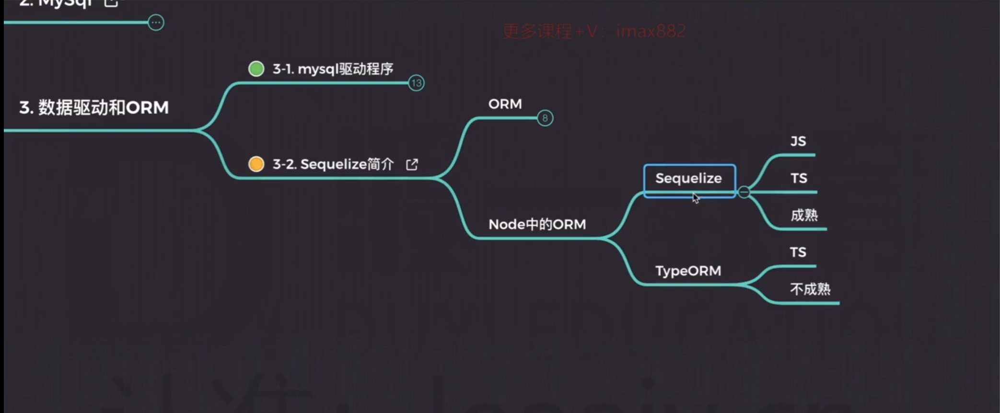
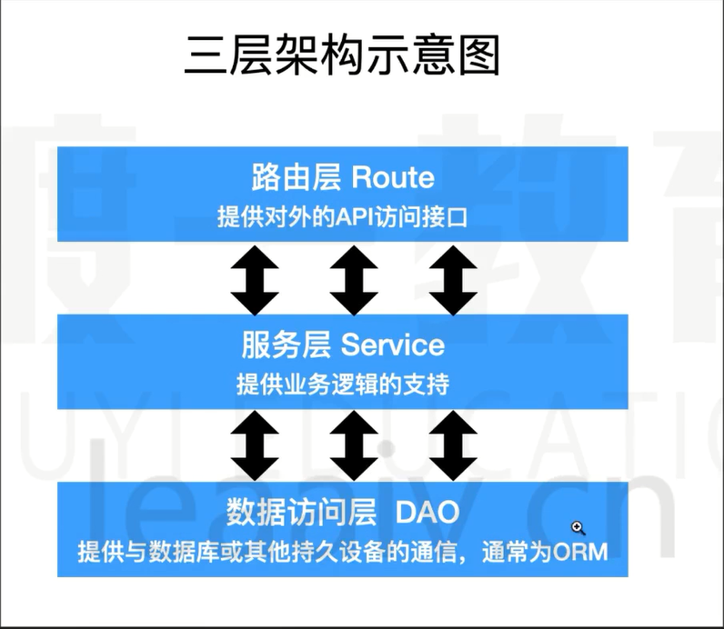
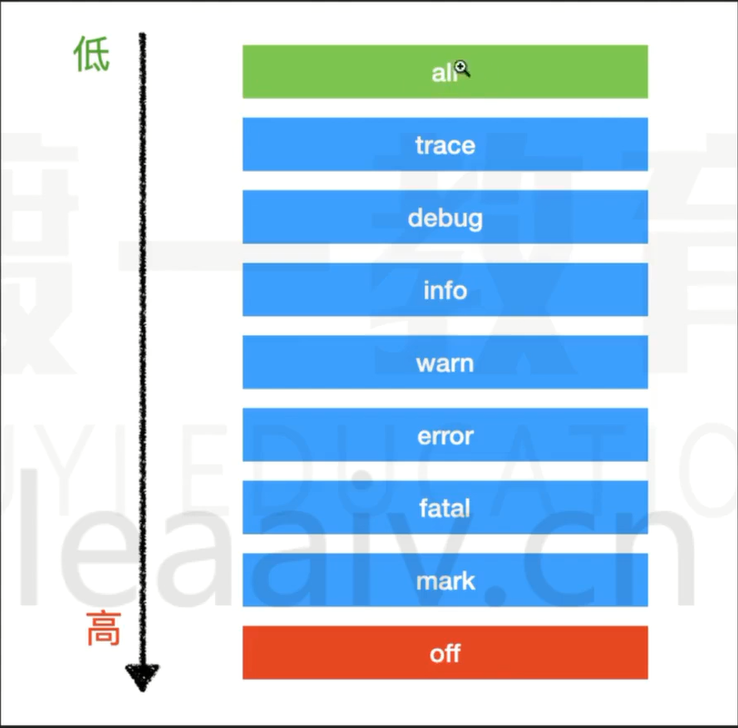

## ORM框架（sqeuelize）🎃

### 简介

[官方文档SqeueLize](https://sequelize.org/docs/v6/core-concepts/model-basics/)

**1 ： Object Relational Mapping （对象关系映射）**

**作用**

1. 通过`ORM`框架，可以自动的把程序中的对象和数据库进行关联，更方便管理
2. `ORM`框架会隐藏具体的数据库底层细节，让开发者使用同样的数据库操作接口，完全对不同的数据库操作

**优势**

1. 开发者不需要关心数据库，只需要关心自己定义的`model`即可生成数据库表字段
2. 可轻易的完成数据库的移植
3. 无需拼接复杂的sql语句即可完成精确查询功能
4. 连接各个数据库，统一内部操作数据，不需要手动写sql，简单高效，可维护性高

## 入门🎁

### 基本配置

**desc** ： 连接到数据库

~~~js
const { Sequelize } = require('sequelize')
const { authInfoGroup } = require('../../constant/index')

const { ACCOUNT, PASSWORD } = authInfoGroup
const sequelize = new Sequelize('ormdb', ACCOUNT, PASSWORD, {
  host: 'localhost',
  port: 3306,
  dialect: 'mysql',
  logging: null // 是否需要详细的打印日志
})
async function Main() {
  // try {
  //   await sequelize.authenticate();
  //   console.log('Connection has been established successfully.');
  // } catch (error) {
  //   console.error('Unable to connect to the database:', error);
  // }
  // console.log('连接成功');
  // sequelize.close()
}
Main()
module.exports = sequelize
~~~

### model 层

`model `  模型实例是ORM框架的一个核心要点，它可以根据传入的 `JavaScript`对象 帮助我们生成数据库字段，从而与数据进行统一。

#### 创建一个模型

~~~JavaScript
sequelize.define('模型名称' , 模型对象)
const { DataTypes } = require('sequelize')
const sequelize = require('./db')
const { modeNameGroup } = require('../../constant')

const Admin = sequelize.define(modeNameGroup.Admin, {
  loginId: {
    type: DataTypes.STRING, // 类型
    allowNull: false, // 是否允许为空
  },
  loginPwd: {
    type: DataTypes.STRING, // 类型
    allowNull: false, // 是否允许为空
  },
}, {
  updatedAt: 'updateTime',
  deletedAt: "deleteTime",
  createdAt: "createTime",
})

module.exports = Admin
~~~

### service层

用于处理数据操作数据库并且返回一些指定的数据等，该层会参与服务端逻辑验证，通过后响应对应的数据

~~~js
const { Admin } = require('../models')
async function addAdmin(adminObj) {
  if (!adminObj) return
  const modelInstance = await Admin.create(adminObj) // 数据处理
  if (!modelInstance) return // 如果没有实例则 结束操作
  return modelInstance.toJSON() // 返回数据处理后的对象
}
async function deleteAdmin(id) {
  if (!id) return
  //  方法1 查询实例是否存在 存在 则销毁 不存在 结束
  // const modelInstance = await Admin.findByPk(id) // 查询是否有改条记录
  // modelInstance && modelInstance.destroy()// 销毁实例

  // 方法二 通过 本身进行销毁
  Admin.destroy({
    where: { id }
  })
}
async function updateAdmin(id, adminObj) {
  /**
   * 方式1
   */
  // const modelInstance = await Admin.findByPk(id)
  // if (!modelInstance) return
  // modelInstance.loginId = await adminObj.loginId
  // modelInstance.save()
  // return modelInstance.toJSON()
  Admin.update({ loginId: adminObj.loginId }, {
    where: { id }
  })
}
module.exports = {
  addAdmin,
  deleteAdmin,
  updateAdmin
}
~~~

## 服务端分层架构🎫

### route层

 **作用** ： 负责 前端访问服务器路由地址接口的处理，转发到对应的`service` 层，负责接口地址逻辑处理

~~~js
const express = require('express')
const app = express()
const studentRouter = require('./modules/students')
app.use('/bff/student' , studentRouter)
app.listen(8081, () => {
  console.log('listen in on 8081');
})

~~~

### service层

 **作用** ： 负责处理相关的业务逻辑，在此层验证数据等操作，通过后调用 `model`实例的方法进行 `crud`操作，让然后将对应的数据返回

**example**（示例）

~~~js
const { Student } = require('../models/index')
const { isEmpty } = require('../utils')
async function getStudents({ page = 1, pageSize = 10 }, where = null) {
  const offset = (page - 1) * pageSize // 分页页数  第几页 
  const limit = pageSize // 一页多少条
  const { count, rows } = await Student.findAndCountAll({
    where,
    limit,
    offset
  })
  return {
    total: count,
    data: JSON.parse(JSON.stringify(rows))
  }
}
~~~

### model层

**作用**： 负责模型数据的定义以及类型处理，你可以通过每个对象的 `set` or `get` 进行中间处理，你也可以手动创建该模型或者 批量创建模型，当你运行 `sync`方法时 它会同步你的模型到数据库，并且你还可以与其它表建立 外键 关系等。

**example**（示例）

~~~js
const { DataTypes } = require('sequelize')
const sequelize = require('./db')
const { modeNameGroup } = require('../../constant')
const Student = sequelize.define(modeNameGroup.Student, {
  name: {
    type: DataTypes.STRING, // 类型
    get() {
      return `${this.getDataValue('name')} - ${this.getDataValue('birthdady')}`
    },
    allowNull: false, // 是否允许为空
  },
  birthdady: {
    type: DataTypes.STRING, // 类型
    allowNull: false, // 是否允许为空
  },
  sex: {
    type: DataTypes.INTEGER,
    allowNull: false,
  },
}, {
  updatedAt: 'updateTime',
  deletedAt: "deleteTime",
  createdAt: "createTime",
})
module.exports = Student
~~~

## 模型查询数据（model query）🛒 

### API

1  : ``findAll``

>查询符合条件的所有数据，返回一个列表 

~~~js
await model.findAll(config)
~~~

2 : `findByPk`

>根据指定的参数查询 ，例如根据 `id`查询是否有该记录，有则返回实例，否则返回null

~~~js
await model.findByPk(id) // 查询是否有改条记录
~~~

3 ： `findOne`

>查找一条符合条件的记录，返回结果 有则返回实例，否则返回null

~~~js
await Admin.findOne({
    where: {
      loginId,
      loginPwd
    }
 })
~~~

4 ： ``findOrCreate`

>查找或者创建一条记录，如果在db中找到该数据，则进行返回，如果没有则进行创建，你可以传入 `defaults`属性

~~~js
const [user, created] = await User.findOrCreate({
  where: { username: 'sdepold' },
  defaults: {
    job: 'Technical Lead JavaScript'
  }
});
~~~

5 : `findAndCountAll`

>查找所有的数据并且返回查询所有数据的条数

~~~js
const { count, rows } = await Project.findAndCountAll({
  where: {
    title: {
      [Op.like]: 'foo%'
    }
  },
  offset: 10,
  limit: 2
});
~~~

6 ： `bulkCreate`

>批量创建多条数据到数据库中，传入一个array

~~~js
if (isEmpty(stus)) return null
const studentIns = await Student.bulkCreate(stus) // 批量创建数据
console.log('', studentIns);
~~~

7 ： `destory`

>模型实例删除数据操作，你可以根据配置决定是否真正删除数据。

~~~JavaScript
 Admin.destroy({
    where: { id }
 })
~~~

你可以配置模型中的 参数 `Paranoid` 当 为 true 时不会真正删除数据，而是保存一个删除的时间到数据库中。

## 模型基础🏐

### 模型定义

定义一个自己的模型，使用`defind`定义

~~~js
sequelize.define(模型名称，模型选项）
~~~

### 模型配置

`重要参数`

  1  ： `paranoid`

 决定是否要真正的删除数据表中的数据

2：`freezeTableName`

是否要严格按照模型名称作为表名。

3 ： `getter `  or  `setter`

当用户访问属性 或者设置值得时候 作一些中间操作

~~~JavaScript
  name: {
    type: DataTypes.STRING, // 类型
    get() {
      return `${this.getDataValue('name')} - ${this.getDataValue('birthdady')}`
    },
    set() {

    },
    allowNull: false, // 是否允许为空
  },
~~~

4 ： `validate`

模型属性校验，可以在当你给根据模型创建数据的时候，可以进行校验

~~~js
  name: {
    type: DataTypes.STRING, // 类型
    get() {
      return `${this.getDataValue('name')} - ${this.getDataValue('birthdady')}`
    },
    validate: {
      notEmpty: {
        msg: '姓名不能数为空'
      },
      notNull: {
        msg: '姓名不能数为空'
      }
    },
    allowNull: false, // 是否允许为空
  },
~~~

## nodejs-日志输出✌

### log4js🖥

**组成** ： 一个日志由 [时间] + [日志等级] + [日志分类] + [日志信息]  组合而成

~~~js
const log4js = require('log4js')

const logger = log4js.getLogger("javascript") // 设置日志类型 ， 输出在 [2023-09-11T10:04:20.666] [INFO] javascript - logger or in not a function 中

logger.level = log4js.levels.ERROR

logger.error("logger or in not a function")
~~~

### 日志配置

[官方文档](https://log4js-node.github.io/log4js-node/migration-guide.html)

~~~js
const log4js = require('log4js')
const path = require("path")

log4js.configure({  // 日志配置
  appenders: { // 添加一个日志映射类型
    sqlLogAppender: {
      type: 'file', // 输出日志类型//
      filename: path.resolve(__dirname, './logs', 'sql', 'sql.log') //输出日志的地址
    },
    app: {
      type: 'dateFile', //
      filename: path.resolve(__dirname, './logs', 'app', 'application.log'),
      layout: { // 自定义日志格式
        type: 'pattern',
        pattern: '[%h] [%d{yyyy/MM/dd-hh.mm.ss}] %c - [%p] %m'
      },
      maxLogSize: 1024, // 最大文件存储大小
      keepFileExt: true // 是否保持文件以 .log结尾
    },
    default: {
      type: 'file',
      filename: path.resolve(__dirname, './logs', 'app', 'application.log')
    }
  },
  categories: {
      // 日志 类型 ， 它可以根据 appenders 与之对应 然后 输出到不同的日志文件中
    sqlLog: {
      appenders: ['sqlLogAppender'], // 对应上方appenders
      level: 'all'
    },
    app: {
      appenders: ['app'],
      level: 'all'
    },
    default: {
      appenders: ['default'],
      level: 'all'
    }

  }
})
process.on('exit', () => log4js.shutdown())

exports.sqlLog = log4js.getLogger('sqlLog')
exports.appLog = log4js.getLogger('app')
exports.logger = log4js.getLogger('default')
~~~

### 日志级别

## express的基本使用

