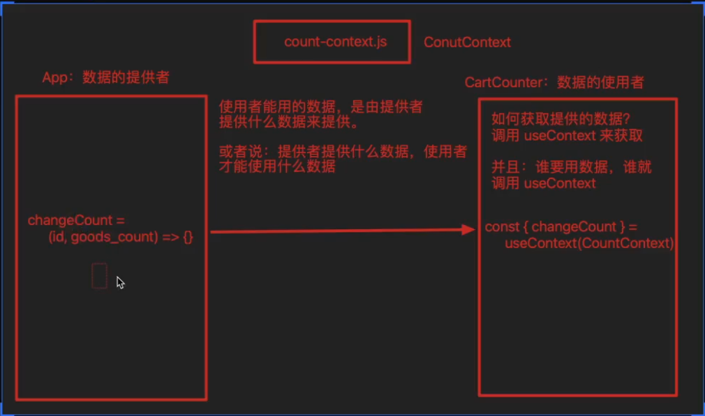
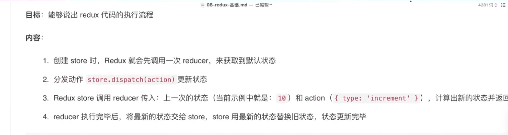
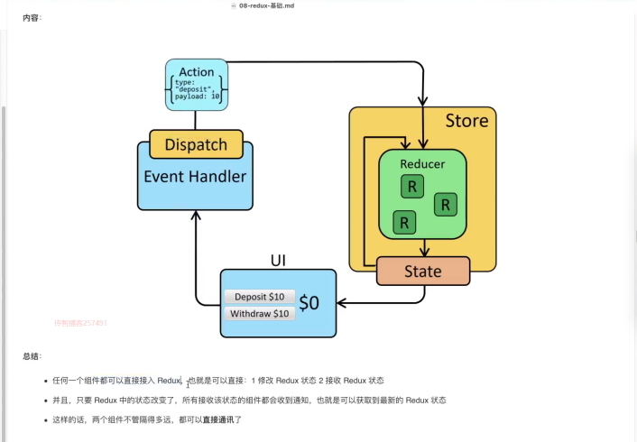
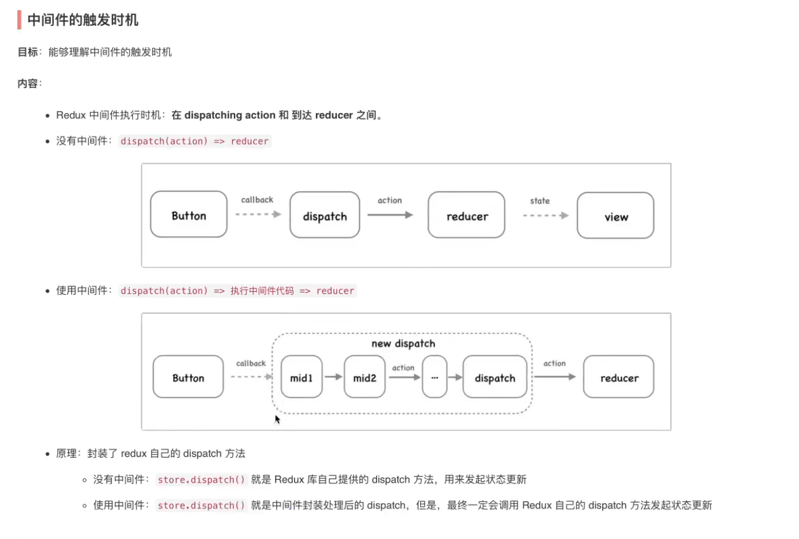
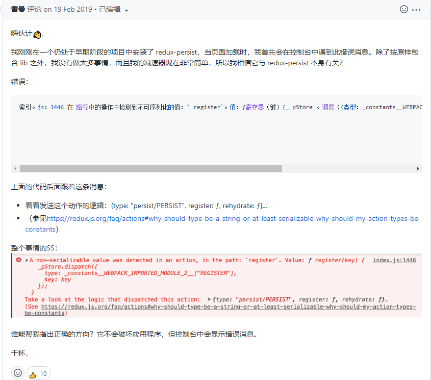

## React 是什么

React 是一个编写前端UI的JavaScript 库 ，用于构建用户界面的 JavaScript 库

## React的特点，它与Vue有什么区别？

### 内部实现原理结构

2.1.1**React**组件之间的数据耦合性低，数据之间的互动需要全权经过React 内部处理，不能直接修改，所以这也是React**数据不可变理念**的原因。

#### 区别

2.1.2  **React** 是单向数据流，数据由最高父级向下传递，vue也是单项数据流，不允许子组件修改父组件的值

- 数据变化的实现原理不同。`react`使用的是不可变数据，而`Vue`使用的是可变的数据
- 组件化通信的不同。`react`中我们通过使用回调函数来进行通信的，而`Vue`中子组件向父组件传递消息有两种方式：事件和回调函数
- diff算法不同。`react`主要使用diff队列保存需要更新哪些DOM，得到patch树，再统一操作批量更新DOM。`Vue` 使用双向指针，边对比，边更新DOM
- 虚拟dom，可以更好的跨平台，进行渲染

#### 共同点

1. 都是通过数据驱动视图更新
2. 都有组件化思想
3. 都有 Virtual DOM  虚拟  Dom ,然后渲染到真实DOM上
4. 都有支持native的方案：`Vue`的`weex`、`React`的`React native`
5. 都有自己的构建工具：`Vue`的`vue-cli`、`React`的`Create React App`

## React 组件化

### 根据组件定义方式

​		可分为函数式组件 和 类组件

### 根据组件是否维护自己状态

​		可分为 无状态组件和有状态组件

### 根据组件职责不同

​		可分为展示型组件和容器组件

## React中父子通信的原理？

>react 中 在父组件定义数据 子组件通过props 接收进行使用 ， 子组件向父组件传值，

## React 中 什么是数据不可变?

数据不可变，是指React中的数据都是都是受控状态，React 内部做了统一的处理，不能够直接修改state里的数据，需要通过setstate 传递一个回调函数给React React内部进行修改，修改完成之后，重新执行Render函数将真实的UI渲染到页面

~~~JS

import { Component } from "react";

const state = {
  mesVal: ''
}

//React 遵循 数据不可变原则 如果系需要修改数据 则通过 setState 方法 将数据 返回给state 进行修改重新渲染

/**
 * 实时监听 input输入框的值  实现原理 ?
 * 1：第一次进入 React 进行初始化  通过render渲染 Dom至页面上
 * 2：首次调用render 函数   而输入框的value值与 state里的 数据进行绑定 此时 通过 onchange 事件进行监听数据变化
 * 3：在onchange 事件中 通过 this.setState 方法进行修改state 数据 ，修改完成后再次调用render 函数 进行重新渲染
 * 
 */
class ChangeValue extends Component {
  // 数据 
  state = state
  // 方法 
  handelChange = (e) => {
    this.setState({
      mesVal: e.target.value
    })
  }

  render () {
    console.log('1111');
    return (
      

        <input type="text" value={this.state.mesVal} onChange={this.handelChange} />
      

    )
  }
}
export default ChangeValue
 */
~~~

## React中 setState与Vue数据更新的区别？

### 更新机制

>Vue通过数据劫持 ，对数据进行监听，如果data中发生变化后 则直接将template 模板 进行render 再执行h函数 进行编译 
>
>#### setState 
>
>​	setState 来自于 Component 实例
>
>​	React 类组件 更新视图 通过 setState 方法 进行视图更新，通过合并对象将新值与旧值替换，再出发render 	函数进行视图更新
>
>#### React 中 setState 性能优化
>
> 	React 中 根据 最新的setState 进行 视图更新
>
>#### setState的参数
>
>参数1 ： 传入更新的对象 或 回调函数
>
>​	对象 ：更新原理，通过object.assign合并之后进行更新
>
>​	回调 ： 回调的参数 ， 第一个 state ， 上一次状态 ， 第二个参数 当前类组件的props 
>
>参数2 ： 当数据更新完成时 React 内部会自动回调 第二个函数 ，此时 即是最新的状态

## React setState 更新数据执行机制 ？

### 异步更新

首先，React 是一个单向数据流UI框架，而Vue是 双向数据流，边对比，边更新DOM , React setstate 更新数据首先会通过依赖收集，然后将需要更新的数据放在一个任务队列中， 当react 监听到不再需要更新数据的时候 ，isBatchingUpdates  （批量更新） 的状态为 true React 内部则会统一更新数据，**当出现更新同一个变量时，后者会覆盖前面**。

### 为什么要设计成异步更新? 

>#### 	**为了提高渲染性能 ，保证最后一次diff 实现一次render** 
>
>#### 	如果 是同步更新 会出现父子组件数据不一致的情况

### React 同步更新实现

将setstate 放在定时器当中，数据则会同步更新

~~~JS
// 是由于 在React 中数据 更新 由于 settimeout 是异步任务  先执行 同步代码 ，当同步代码 执行完毕时 此时 才执行 异步代码 当 同步代码 执行完成时  isBatchingUpdates 标记已成为 false 所以此时会  同步更新数据

解决同步更新的问题，React 内部提供了 ReactDom.unstable_batchedupdates(不稳定的批量更新) 方法，参数为一个回调函数 
ReactDom.unstable_batchedupdates(()=>{
    在此处做异步更新数据操作
})
flushSync() 函数 内部更新

~~~

## React pureComponents 和 Meno

> 作用 ：优化render 函数  当值没有被引用时 则不重新渲染该组件
>

~~~TSX
import { PureComponent } from 'react'
import Home from './components/Home'
import ProductList from './components/ProductList'
interface AppState {
message: string
}
export default class App extends PureComponent {
constructor(props: App) {
 super(props)
 this.state = {
   message: '五花肉'
 } as AppState
}
update() {
 this.setState({ message: '111ss' })
}

shouldComponentUpdate(nextProps: Readonly<AppState>, nextState: Readonly<{}>, nextContext: any): boolean {
 const { message } = this.state as AppState
 if (message !== nextProps.message) {
   return true
 }
 else {
   return false
 }

}
render() {
 const { message } = this.state as AppState
 return (
   

     
这是一个{message}

     <button onClick={() => this.update()}>点击更新</button>
     <Home message={message} />
     <ProductList />
   

 )
}
}
~~~

~~~TSX
import { memo } from 'react';
const ProductList = memo(() => {
console.log('Product Render');

return (
 
ProductList 

)
})

export default ProductList 
~~~

### **pureComponent**

在 类组件 继承 **pureComponents** ，setstate 更新时如果引用的是同一个地址值时，视图将不会更新

​	**原理：React内部 通过 shouldComponentUpdate 新的 props 和 旧的 props 进行浅层比较，如果是同一个引用地址 则React 会认为没有发生更新。**

## React 类组件的生命周期

constructor Super

**组件创建**

constructor React 组件挂载之前调用，但必须与super关键字配合使用

执行 render 

**组件挂载**

componentdisMount

组件挂载后 立即调用 ,  这个方法是比较适合添加订阅的地方。如果添加了订阅，请不要忘记在 componentWillUnmount() 里取消订阅,例如在该生命周期内开启定时器

**组件更新**

componentdisUpdate 

组件更新后会被立即调用

**组件卸载**

componentWillUnmount   应用场景 清除定时器等等

## React 如何阻止组件渲染 

类组件 ，shouldComponentUpdate --> 返回 true || false 

当 返回false 时 即会阻止组件更新渲染

## Hooks useState 数据更新原理 

原理 : hooks useState（初始默认值），每次创建一个useState需要传递一个默认值，usestate 返回的是一个数组，当数据发生更新的时候，usestate 会基于上一次计算完成后的数据进行更新，而不再基于默认值累加

## React高阶组件定义和作用

>#### 高阶函数
>
>1:black_flag: 定义 ：一个函数 接受一个函数作为参数  ，或者该函数返回一个新的函数
>
>#### 高阶组件
>
>2:flags: 定义 ： 一个组件 接受参数 为 组件 并且该组件返回一个新的组件
>
>作用  登录鉴权 props 增强  封装公共的功能
>

## React 中如何实现一个颜色主题切换?

>方式1：通过context 向下传递 主题色 进行 更改对应的 颜色主题，通过 HOC高阶组件 进行封装 consumenr 将提供的值 传递给 新的组件

~~~TSX
import ThemeContext from "./themeColor"

const withContext = (OriginComponent: any) => {

  return (props: any) => {
    return (
      <ThemeContext.Consumer>
        {
          value => {
            return (<OriginComponent {...value} {...props} />)
          }
        }
      </ThemeContext.Consumer>
    )
  }
}

export default withContext 
~~~

## React中Partols 和 Fragment

> **Partols**  :函数 将指定的元素 挂载到指定的dom 节点上
>
>​	参数1 : 传入需要挂载的元素 
>
>​	参数2 ： 传入需要追加到哪里的dom 元素节点
>
>​	参数3 ： key 第几个元素
>
>Fragment : Vue中的template 元素

## React 中 StrictMode 的作用

>1: 识别不安全的生命周期(已经废弃维护的生命周期)
>
>2 ：识别代码中使用过时的Api
>
>3：检查意外的副作用 
>
>​	3.1 组件 constructor 被调用两次
>
>

## 使用 CreateContext 和 useContext 实现跨组件通信

>#### useContext 跨组件共享数据  实现原理
>
>1：生产者 ，也就是数据提供者 （provider ）
>
>2：消费者 ，也就是数据使用者 （consumer ）
>
>3：数据中间件  
>
>使用一个公共的JS文件用来保存 数据的状态   
>
>~~~JS
>// 数据状态 中间件 publicState变量
> const publicState  = createContext()
>// 返回消费者 和 生产者   
>~~~
>
>###### 生产者 provider 
>
>~~~react
>   <CounterContext.Provider value={{   通过value 提供数据 并包裹 需要传递数据的组件 
>        changeCount
>      }}</CounterContext.Provide>
>~~~
>
>###### 消费者 consumer 
>
>~~~JS
>// 接收数据 
>// 通过  useContext接收数据 useContext(传入中间件 publicState变量) 即可拿到生产者发布的数据
>// 消费者即可 进行使用 
>import {useContext} from 'react'
>const { changeCount } = useContext(CounterContext)
>~~~
>
>

## class setState 和 hooks setState 的区别 

~~~TSX
// 1：数据更改的方式不同

class 类组件 更新state 数据  需要通过 this.setstate ({},()=>{}) 

this.setstate({

count:this.state.count+1

}) || 或 this.setstate(prevState=>{return{count:prevState.count+1}})

// 函数组件 setstate 
const [state,setstate] = usestate(默认值)
setstate({
更新的数据
})|| setstate( prev =>{return 更新的数据})

// 2  数据更新处理依赖收集不同
//  类组件 this.setstate 会通过 一次性收集拿到最后一次更新的动作

// 函数组件 setstate 每一次调用会同步更新数据

/**
3： 传递的参数不同 
类组件 this.setstate 可传递两个参数 
参数一  传递一个更新后的对象或函数 
参数二  回调函数 获取更新后的最新值

函数组件 hooks setstate  
只能传递一个参数
*/

~~~

## react纯函数

1. 什么是纯函数？？	

纯函数 ， 对应的输入有对应的输出，函数内不允许更改外部的值，外部传入的值，提供函数使用，如果函数内部更改了值，就打破了纯函数概念。

## react UseEffect函数

useEffect 函数 的返回值 可以是 void | callback | undefind

当 useEffect 函数 返回值为一个函数时 ， 函数会在 组件卸载的时候自动回调

useEffect 接收两个参数 

params1 ： callback 

params ： 依赖项 | [] 

## redux的三大核心概念

- **action  动作       action :执行派发的某些动作 进行数据操作任务派发******
- **store整合 action 和 reducer   (数据仓库) 状态收集**
- **reducer 数据更新   对store 数据进行操作，更新等**

## redux 三大原则

1. 单一数据源
2. state 是只读的
3. reducer 纯函数 修改数据

## react类组件 中无法通过JS进行跳转路由如何解决？

使用 HOC 高阶组件 ， 对类组件进行二次封装，返回一个新组件

## 类组件和函数式组件是如何维护自己的状态的？

1：类组件可以在组件实例中保存一些数据在 this身上 ， 而 函数式组件 想要保留状态你必须通过 useState

## useEffect 和 useLayoutEffect 的区别

~~~tsx

useEffect // 在组件Dom渲染完成之后进行执行

useLayoutEffect // 在组建dom渲染之前进行调用

~~~

## useImperativeHandle的作用

可以将指定的ref 的 `current` 身上返回指定的对象，增加了Dom可操作性

~~~jsx
import { forwardRef, memo, useImperativeHandle, useRef } from 'react';

const ChildrenInput = memo(forwardRef((props, ref: any) => {
  useImperativeHandle(ref, () => {
    return {
      focus() {
        console.log('foucs');
      }
    }
  })
  return <input type="text" ref={ref} />
}))

const App = memo(() => {
  const inputRef: any = useRef()
  const getFoucs = () => {
    inputRef.current && inputRef.current.focus()
  }
  return (
    

      <ChildrenInput ref={inputRef}></ChildrenInput>
      <button onClick={getFoucs}>getFoucs</button>
      
App

    

  )
})

export default App
~~~

## 箭头函数返回对象为什么需要加上小括号()？

由于箭头函数 （）=>{函数体}  返回执行的函数体本身也是需要{}包裹的，作为作用域，而返回一个对象也是 {} 此时 JS引擎内部无法识别，是对象还是函数体结构划分，所以如果需要返回一个对象，则 箭头函数 需要加上 小括号   ( )=> ({}) 即可

## Store 订阅状态的改变（变化）

>**reducer  理论** : 通过   const Store = createStore(reducer) 可拿到store  ,createStore 传递一个reducer 进行数据更改 ，为了保证reducer 是一个纯函数 ，内部执行必须要有**默认值** 和  **上一次的状态，不可直接更改**，没有匹配的必须要返回最初的state 

>通过 Store.subscribe()方法  获取订阅的数据，每次数据更新即可拿到 更改的状态，每次数据更新时触发，类似于 class 组件中 componentditupdate() 函数 
>
>Store.subscribe() 函数的返回值  可截断当前订阅 发布 ，在   Store.dispatch(increment(10))  分发action 之前可截断 

~~~js
import { createStore } from 'redux'
export default function redux_reducer () {
  const increment = payload => {
    return { type: 'increment', payload }
  }
  const decrement = payload => {
    return { type: 'decrement', payload }
  }
  const reducer = (state = 0, action) => {
    switch (action.type) {
      case 'increment':
        return state + action.payload
      case 'decrement':
        return state - action.payload

      default: return state
    }
  }

  const Store = createStore(reducer)
  // 发布订阅  监听数据变化  subscribe 函数 返回值是一个 函数 可取消订阅中断监听  subscribe 方法监听redux 数据更新
  const unsubscribe = Store.subscribe(() => {
    console.log('最新状态为Subscribe', Store.getState());
  })

  // 拿到初始值 
  // 两次分发 redux是基于上一次的值进行更改 

  Store.dispatch(increment(10))

  unsubscribe()

  Store.dispatch(decrement(5))
  console.log(Store.getState());

~~~

## Redux 执行流程

>  const Store = createStore(reducer)
>
>redux 在      const Store = createStore(reducer) 初始化时 redux  会去调用reducer 更新状态  拿到 state 的默认值 ，当 代码执行 store.dispatch()时 此时 action 可根据上一次获取的值进行计算更新，通过reducer 拿到上一次的状态进行更新并返回  将更新后的状态重新提交给 store 将新数据进行替换

## redux执行流程图

## Redux的数据流向

用户在UI层发生视图编辑更改，redux 内部通过**dispatch** 分发**action**  reducer 在创建 configureStore时 进行 state 数据初始化 ，再执行 指定的action  进行reducer 更新state    最终返回给react UI页面，进行渲染

## Redux 中间件 执行流程 

## Redux配置数据持久化

~~~js
import  { configureStore } from '@reduxjs/toolkit' /// 导入 configureStore 配置商店
import {RootReducer} from "@/store/reducer";  //配置根 reducer  RootReducer 
import  thunk from 'redux-thunk'  // 导入thunk 中间件

// 导入持久化 数据的Store 和 persistReducer("传入配置对象",'传入RootReduce')
import { persistStore, persistReducer } from 'redux-persist' 

// storage 数据存储本地对象
import storage from 'redux-persist/lib/storage'

// 配置 persistConfig 对象
const persistConfig = {
    key: 'root',// 存储对象根节点
    storage,   // 采用本地缓存
    whitelist: ['MainPageBaseInfo'] // 白名单，例：只有login会被持久化
}
// 将reducer 加入持久化
const persistedReducer = persistReducer(persistConfig,RootReducer)

const store = configureStore({
    // 将reducer 放入 store 中
    reducer:persistedReducer,
    // 开启 devtools 工具
    devTools:true,
    // 配置thunk 中间件
    middleware: [thunk ]
})
export  const PersistStore = persistStore(store)

export default  store

// 项目跟目录 index 下配置
import { PersistGate } from 'redux-persist/integration/react';
import { PersistStore } from '@/store';

    <PersistGate loading={null} persistor={PersistStore}>
                    <App />
    </PersistGate>

~~~

## 解决react 数据持久化 配置错误

>https://github.com/rt2zz/redux-persist/issues/988
>
>解决方案  配置 middleware  以数组的方式加入
>
> https://redux-starter-kit.js.org/api/getdefaultmiddleware
>
>

## redux中的性能优化

### 使用 useSelector 进行数据获取的

​	**性能问题** ： 获取redux数据的时候，如果父子组件都用到了同一个模块的数据，但此时 父组件对该模块一个属性值进行`dispath`，导致  `state` 发生变化 此时 子组件也发生了 `render`

**如何优化** ？

我们可以在 子组件使用的  `useSelector`进行传入第二个参数，`shallowEqual`，react 会自动根据上一次模块的数据和当前模块数据 是否发生改变 ， 如果引用的值发生了改变则该组件重新渲染，没有变化，则不需要重新渲染。

~~~jsx
const HomeChildren = memo(() => {
  const message = useSelector((state: couterModule) => state.counter.message, shallowEqual)
  console.log("HomeChildren Render")

  return (
    
 children Component {message}

  )
})
~~~

