# 第一章 ： 计算机网络的组成

## 组成

硬件 + 软件 + 协议 

## 工作方式 

`边缘部分 ` -> 用户直接使用    {  C/S P2P 方式   } 

`核心部分`-> 为边缘部分服务 

## 功能的组成 

通信子网 + 资源子网

​	`通信子网` 主要在 物理层 ， 数据链路层 网络层 进行 介质传输 

​	`资源子网` 主要在 应用层 表示层  会话层  ，实现 资源共享功能的设备和软件的集合  

网络的七层模型

- [ ] `应用层` 
- [ ] `表示层`
- [ ] `会话层` 
- [ ] `传输层`
- [ ] `网络层`
- [ ] `数据链路层`
- [ ] `物理层`

## 分类

按照`区域`分类 : 广域网  , 城域网 , 局域网 , 个人区域网

按使用者分为  ： 专用网络 ，公用网络

按照 拓扑结构分为 ： 总线型  星型 环形 网状行 

按传输技术 分为 ： 广播式（大学课堂的广播） 和点对点网络 

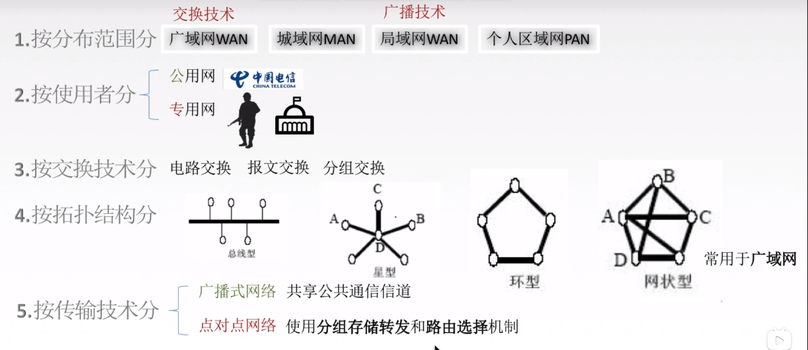

## 速率，带宽，吞吐量

### 速率 ： 

 即数据率或数据传输率或比特率

 	bit （比特）  1 / 0 位  是连接计算机网络上的主机在数字信道上传送数据位的速率

单位是 ： b/s  , kb/s , mb/s , GB/s , Tb/s 

如果传输的 数据是 0101010101  则 传输速率 是 10b/ s

1个字节  = 8bit(比特)

### 带宽

`链路带宽` ： 是指 机身或者机器本身支持的 最高传输速率 

链路的传输速率 ： 2 * 10  八次方  m/s , 电磁波每微秒 可以传输 200m

总结 ： 链路带宽越高 ， 则传输速率 越快

###  吞吐量 

链路带宽 ： 是指 机身最高的 发送速率 以及传输 速率 

吞吐量 =  服务器的响应传输速度 的总和

## 时延（时间延迟）

根据类型 可以分为  `发送时延`  , `传播时延`,  `排队时延` , `处理时延`

发送时延 ： 数据长度 / 带宽（发送速率） 

传播时延 :  该数据在光纤，电缆 ， 通过电磁波传输的速率所消耗的时间   ---->   信道长度 / 电信号传输的速率

排队时延 ： 交换机， 路由器等待处理所消耗的时间

## 网络分层的应用

### 为什么 要进行网络分层 ？ 

**发送文件前要完成的工作:**	

1. 发起通信的计算机必须将数据通信的通路进行激活
2. 要告诉网络如何识别目的主机。
3. 发起通信的计算机要查明目的主机是否开机，并且与网络连接正常。
4. 发起通信的计算机要弄清楚，对方计算机中文件管理程序是否已经做好准备工作
5. 确保差错和意外可以解决。

**分层的原则 ：** 

1. 各个层之间的是相互独立开的，每层只实现一种相对独立的功能
2. 每层之间界面自然清晰，易于理解，相互交流应尽可能的少
3. 结构上可分隔开，每层采用最合适的技术来实现
4. 保持上下层的独立性 ， 下层为上层提供服务
5. 整个分层结构应该促进标准化工作进行

**网络分层的组成方式**

对等实体 ： 如果实体的层级相等 ， 则称为 对等实体 

网络分层 由，实体 ， 协议 ， 接口 ， 服务 四个部分组成

​	**数据单元如何组成 ？**

SDU 服务数据单元：为完成用户所要求的功能而应传送的数据

PCI协议控制信息 : 控制协议操作一信息

由第一层的 SDU + PCI  组成数据单元（PDU） ， 然后 再将当前一层的 数据单元 给到下一层 + PCI 组成新的数据单元，直到最后一层

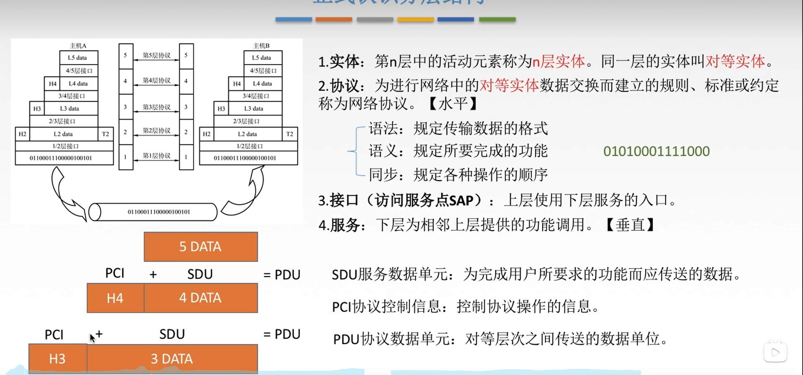

## ISO/OSI参考模型

**七层模型** 

​	物理层 ， 数据链路层 ，网络层 ， 传输层 ， 会话层 ， 表示层 ， 应用层 

**各个系统和主机之间数据是如何传输的？**

 主机之间，需要通过中间介质 进行传输 ， 才能使对方收到 ， 而 对于 上面四层 （ 主机与主机之间只关心 点到点） ， 而 中间介质，传输的时候，是点到点之间的信息传输 ，而中间介质传输 ， 只有  物，数，网，三层的传输 ，并且 是点到点传输（从中间介质 到 另外一个中间 介质） 

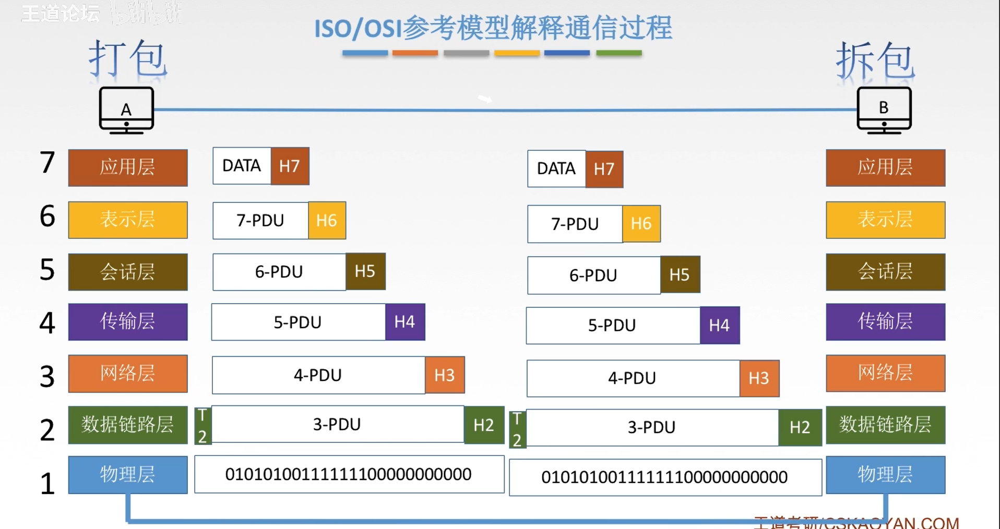

**七层模型 ， 各个层之间的作用？**

### 应用层

​	对协议的定义 ，看稍后内容

### 表示层 

1： 对数据进行转义，解析，根据主机的编码进行转义然后 传到应用层

2： 对数据进行加密处理

3：数据压缩和恢复

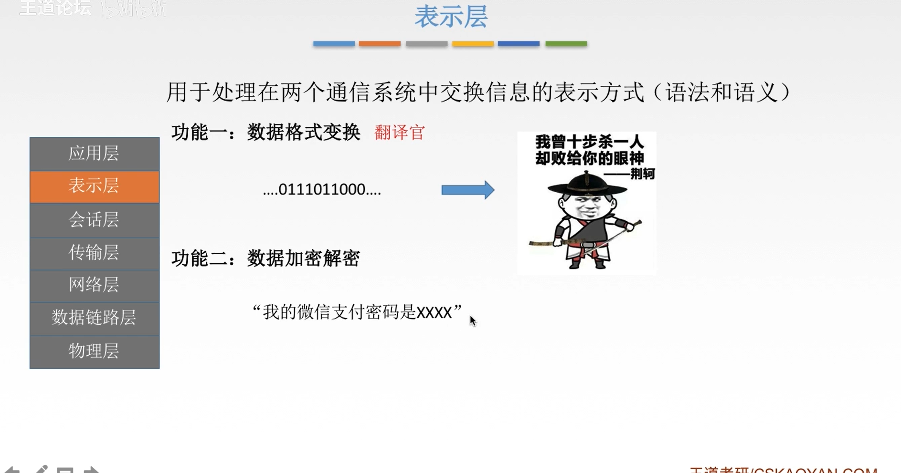

### 会话层

1：与主机之间 建立一次会话连接，管理会话和终止会话 ， 是会话层做的事情。

2：保证会话的连接，使用校验点可以让会话从通信失效的地方重新连接

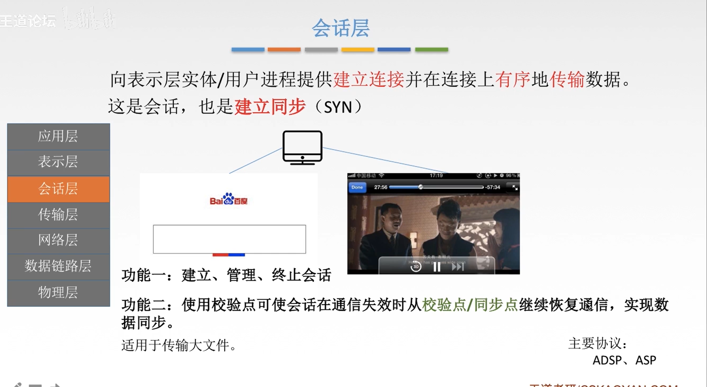

### 传输层 

1：主要作用是两台主机之间进程与进程的访问 ， 也就是 端到端 

2：确保数据的可靠性和不可靠性， 对于大的数据我们确保可靠性 ， 对于小的数据 可以不需要确保可靠性

3：流量控制，控制发送方速度 ， 由于接收方无法快速接收 ， 所以控制发送方的发送速度

4:  复用 和分用 

​	复用 ： 多个应用层可同时使用下面的传输层的服务。

​	分用 ： 运输层把收到的信息传输到对应的应用层对应的进程

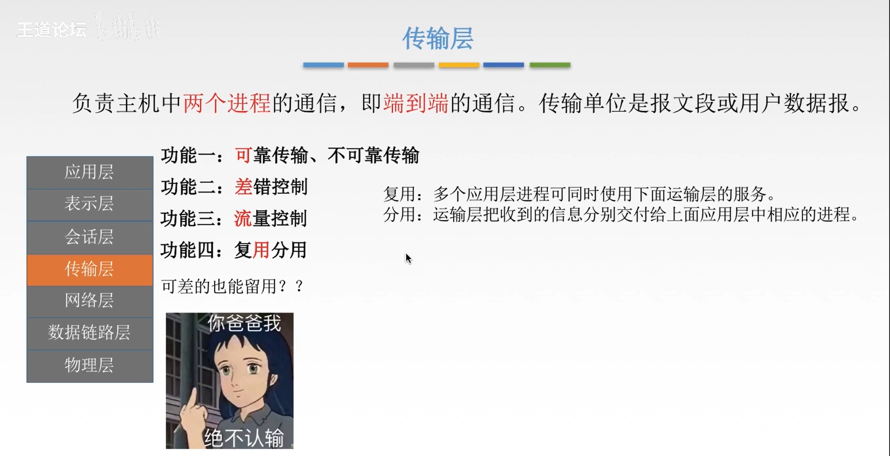

### 网络层

1. 路由选择 ， 选择最佳路径
2. 流量控制
3. 差错控制
4. 拥塞控制

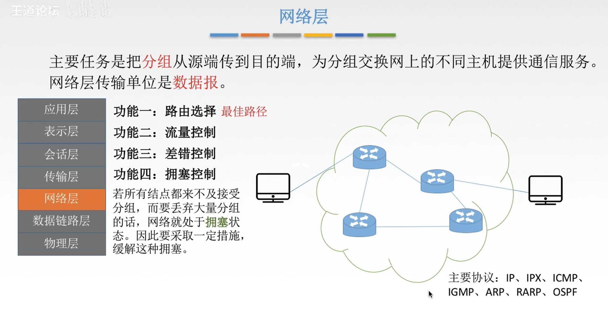

### 数据链路层

1：对数据进行组装，定义分析的开始位置和结束位置 ，将传输的数据组装成帧，携带给物理层

2：纠错 ，对数据进行差错处理 ， 如果发现不符合数据规范的则 ， 会抛弃该数据

3：流量控制

4：掌握对信道的访问和控制权限

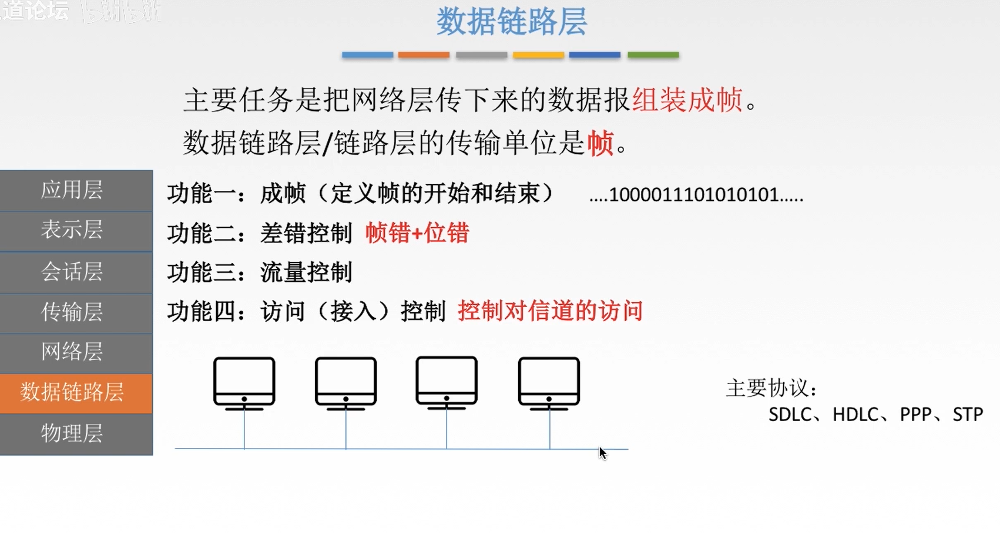

### 物理层

1. 定义接口特性，如何连接 ， 定义连接方式
2. 定义传输方式 ， 双工 半双工 单工
3. 定义传输速率
4. 比特编码 ， 定义比特编码 ， 弱电波代表什么 ， 强电波代表什么

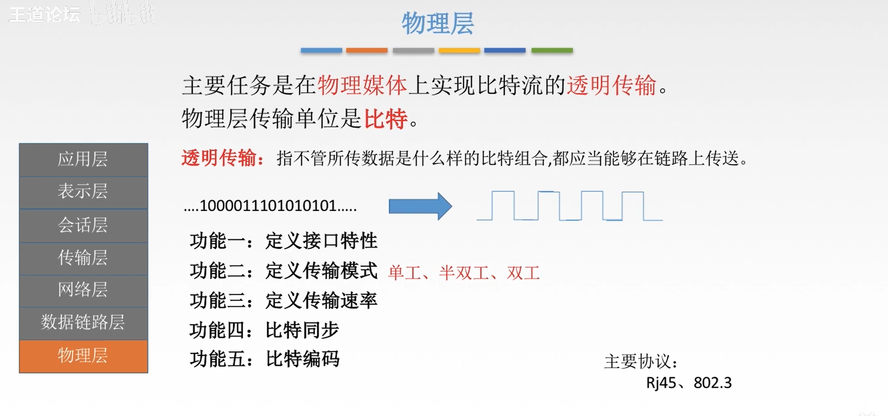

### OSI 参考模型 

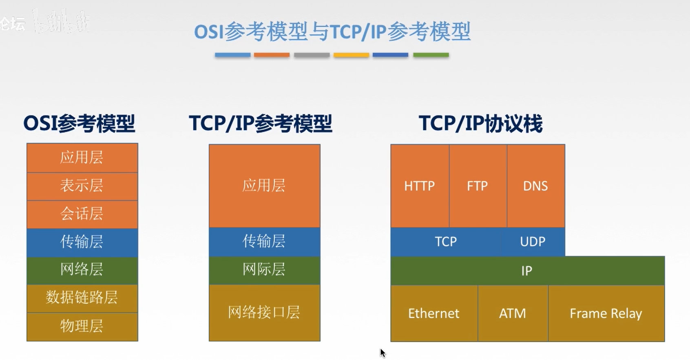

# 第二章 ： 物理层基本概念

## 数据通信模型

`通信过程` ： 由发送端将数据转换成数字信号，通过网卡发出到，调制解调器，调制解调器模拟信号 ，发送到广域网段 ， 由广域网转发到对应的接收器 ， 接收器 根据 接收到的数据 进行转换，最终发送给另外一段

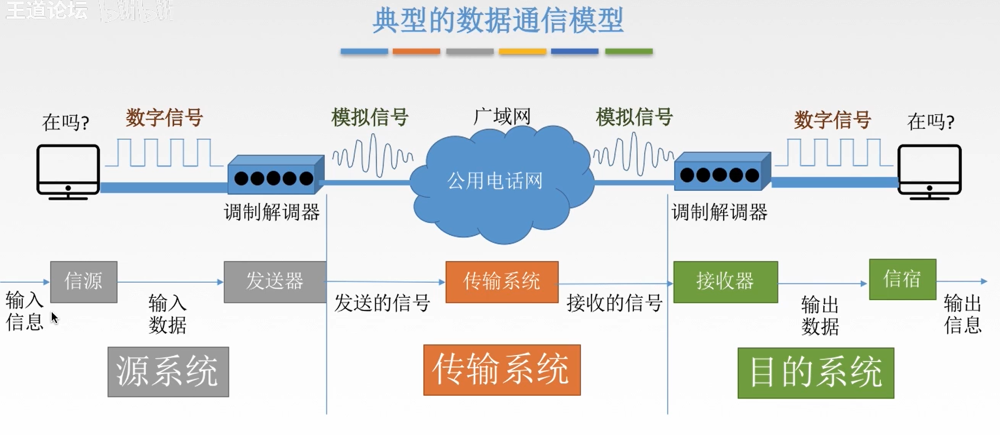

### 数据通信的表现形式

#### 信号 ： `数字信号` , `模拟信号`

数字信号  ： 强电波代表 1 ， 弱电波代表0 ， 他们通常 以 0101 的方式

模拟信号 ： 通常以曲线的形式通信

#### **信道**

按照 传输信号分为 模拟信道 和 数字信道 

按照传输介质 可分为 无线传输 和有线传输 (光纤 等)

#### **通信方式 **

分类 ： `单工通信 ， 半双工通信， 双工通信`

单工通信 ： 只有一方 发送 ， 没有返回交互（信道为 1）

半双工通信 ： 可以双方通信 ， 但 同一时间 只允许一方 进行发送（信道为 2 ）

双工通信 ： 可以双方同时进行发送和接收（信道为 2 ）

#### **数据传输方式**

按照类型 可分为  `串行 传输 和 并行传输`

串行 ： 

​	费用少 ， 速度慢，适合于远距离

并行 ：

​	 速度快，费用高 ， 适合近距离，一般是用于电脑内部传输

## 数据通信单位

### 码元

码元就是 固定长度的信号波形，在传输的数据的情况下，根据比特位进行携带，例如现在是 4进制传输，那 1码元 等价于 4bit (1 码元 = 4 bit)

### 速率

传播速率 ： 光信号在光纤电缆传播的速率，以电磁波为载体的信号传输速度 

传输速率 ： 在主机内的发送出去的速度

**码元传输速率**： 1 brud（波特） = 1 码元

**信息传输速率**：M * n bit / s (M 代表几个码元) （N ： 多少bit位）

## 码间串扰-奈式准则-香农准则

### 码间串扰原理

由于 短时间内传输的速率过快，接收方无法清楚分析传输的信号是什么，所以就会出现码间串扰，导致解析失败问题，于是就出现了`奈式准则`

### 奈式准则

由于传输可能出现过快的原因，奈式准则定义了传输码元速率的上限为 2w baud（波特），w是信号带宽，单位是HZ，理想低通信道下的极限数据传输率 = `2wlog2V (b/s)` v 是多少码元

**奈式准则解决的问题**

1. 在任何信道中，传输码元的速率是有上限的，传输比率过快会严重出现码间串扰问题，因此 奈式准则显示了码元传输速率
2. 信道频带越宽（则能通过的信号高频分量越多），就可以更高的传输码元
3. 奈氏准则给出了码元传输速率的限制，但并没有对信息传输速率给出限制。
4. 4.由于码元的传输速率受奈氏准则的制约，所以要提高数据的传输速率，就必须设法使每个码元能携带更多个比特的信息量，这就需要采用多元制的调制方法

### 香农准则

在带宽受限且有噪声的信道中，为了不产生误差，信息的数据传输速率有上限值。

**定理**

1.信道的带宽或信道中的信噪比越大，则信息的极限传输速率就越高

2.对一定的传输带宽和一定的信噪比，信息传输速率的上限就确定了

3.只要信息的传输速率低于信道的极限传输速率，就一定能找到某种方法来实现无差错的传输。

4.香农定理得出的为极限信息传输速率，实际信道能达到的传输速率要比它低不少

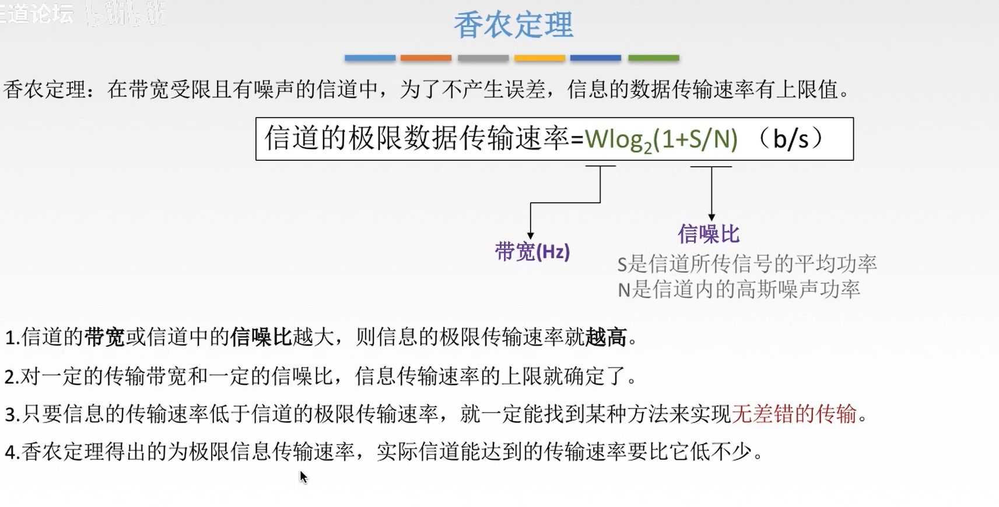

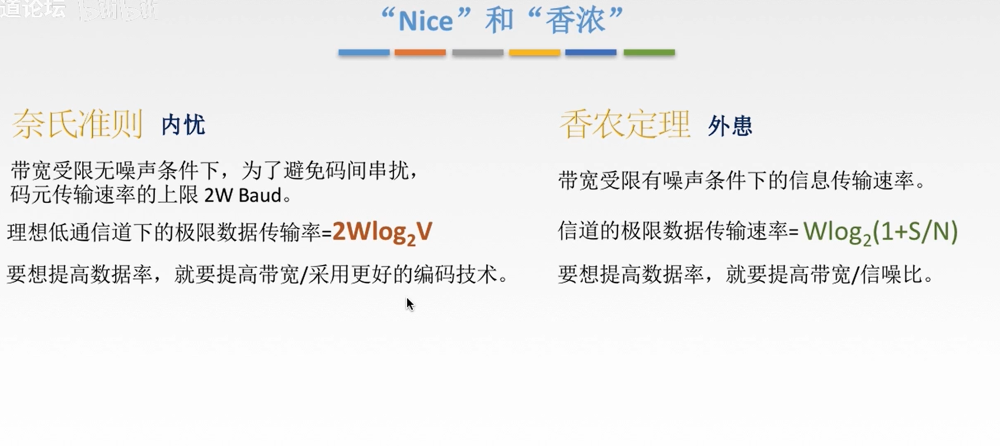

## 编码与调制

### 数字信号

 编码 ： 数据 -> 转换为数字信号 即为 `编码`，通过数字发送器  转为数字信号（编码）

调制 ： 数据 -> 转换为模拟型号 即为  `调制`，通过调制器 转为模拟信号（调制）

### 模拟信号

 编码 ： 数据 -> 转换为数字信号 即为 `编码`，通过PCM编码器  转为数字信号（编码）

调制 ： 数据 -> 转换为模拟型号 即为  `调制`，通过放大器调制器 转为模拟信号（调制）

## 中继器和集线器

### 中继器

功能 ： 放大数字信号，一端输入，另一端输出 。

​	特点 ： 必须是 同一个协议才能放大 

### 集线器

功能 ： 对信号进行再生放大 ，对衰弱的信号进行放大，接着转发到其他所有处于状态的的端口上，增加信号的传输距离。