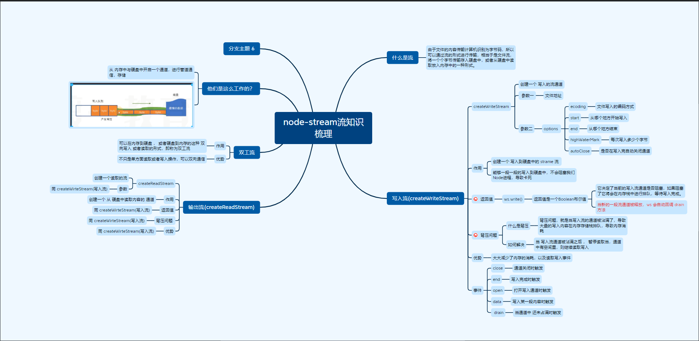
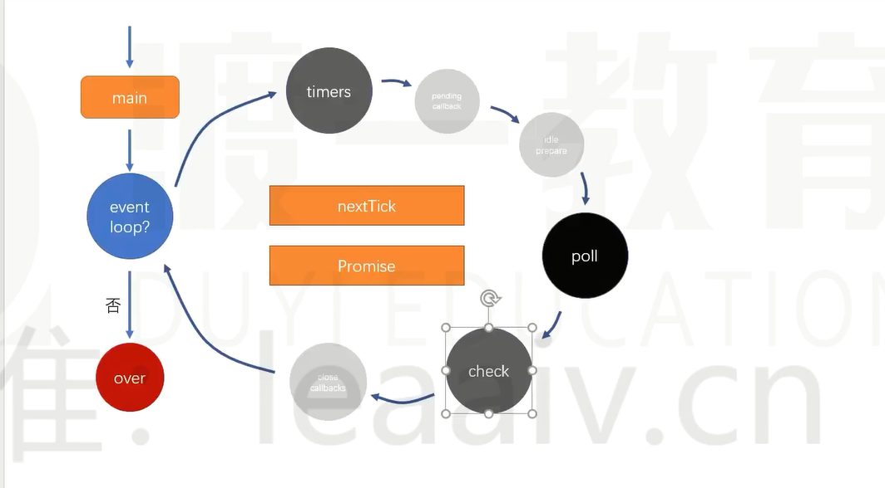
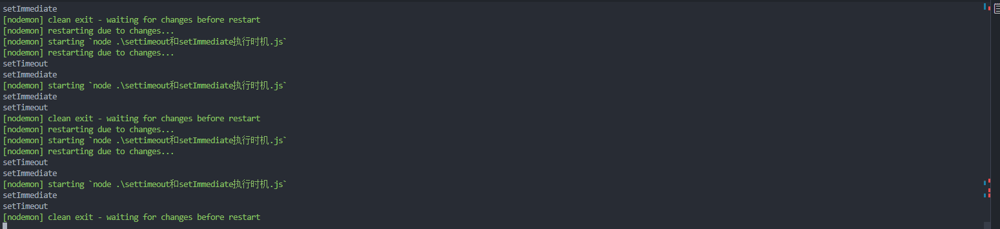

# node课程笔记

## node中全局对象💍

### global

nodejs中的全局对象

### setTimeOut ， setimmediate ，setInterval

## ASCII码表🎨

## buffer对象 ⚽

### 字符串大小

中文每一个utf-8 的占用 `3`个字节

### alloc

~~~JS
let buf_1 = Buffer.alloc(10)  // 创建的 空间 使用后就被销毁
~~~

### allocUnsafe

~~~JS
let buf_2 = Buffer.allocUnsafe(1000) // 创建的空间无法被销毁
~~~

### 使用十进制数据转换字符

~~~JS
// buffer 一些基本操作
let buf_4 = Buffer.from([105, 108, 111, 118, 101, 121, 111, 117]); // 八个 十进制的ascll

console.log(buf_4.length);

// for (let i = 0; i < buf_4.length; i++) {
//   console.log('你知道这是什么吗?', buf_4[i].toString(2));
// }

console.log(buf_4.toString().toLocaleUpperCase())  // buffer 转 字符串

let buf = Buffer.from('Assets')

console.log(buf[0]) 

~~~

## node中 ES模块🎃

### node中 定义 es 模块 的方式

1. mjs(定义文件名以 .mjs 结尾)
2. 设置 package.json  type = module

#### **它们与commonJs的区别 ？**

`commonjs` 运行在函数环境中

`esModule` : 运行在模块中，无 `export` or `module.export` 

`esModule.mjs`

~~~JS
export const a = 3

export default {
  c: 'index'
}

~~~

`index.mjs`

~~~js
import * as esModule from './esModule.mjs';

console.log('esModule', esModule);
~~~

## fs模块💻

### fsReadFile 方法

`callback`形式

~~~JS
fs.readFile('./testWriteContent.txt' , 'utf-8' , (err , data) => {
    if(err) return
    console.log(data)
})
// or 同步形式 
fs.readFileSync('./testWriteContent.txt' , (err , data) => {
    if(err) return
    console.log(data)
})
~~~

`promises`形式

~~~js
await fs.promises.readFile('./testWriteContent.txt' , 'utf-8')
~~~

### stat方法

获取文件信息

~~~js
const { info } = require("console");

const { stat } = require("fs").promises;

async function test() {
  const fileStat = await stat('./img/windows-copy.png')
  console.log('info', fileStat); // 返回文件信息
  info('上次访问此文件的时间戳', fileStat.atime) // 指示上次访问此文件的时间戳。
  info('上次修改此文件的时间戳', fileStat.mtime) // 指示上次修改此文件的时间戳。
  info('上次更改文件状态的时间戳', fileStat.ctime) // 指示上次更改文件状态的时间戳。
  info('大小', fileStat.size) // 指示文件大小（以字节为单位）。
  info(fileStat.isDirectory()) //是否是文件夹

}
test()
~~~

### writeFile方法

desc ： **异步写入内容到文件中**

~~~js
// 写入内容到文件
const fs = require('fs')

/*
@description flag a ：追加写入
@encoding 字符编码及
*/
function writeFile(path, content) {
  fs.writeFile(path, content, { flag: 'a', encoding: 'utf-8' }, (err, data) => {
      if (err) return console.log('err', err)
      console.info("写入成功 -- 异步")
    })
  }
}

writeFile('./docs/text.txt', '学习nodeJS fs 模块 writeFile 方法')
~~~

### writeFileSync 方法

**desc** ： 同步写入内容到文件中

~~~JS
 fs.writeFileSync(path, content, 'utf-8')
~~~

### appendFile方法

**desc** : 追加写入文件内容

~~~JS
const fs = require('fs');
function appendContent(path, content, sync) {
  fs.appendFile(path, content, (err, data) => {
    if (err) return console.error(err)
    console.log('写入成功');
  })
}
appendContent('./docs/text.txt', '追加写入新的内容 ，这次写入为 好好好哈\d111', false)
~~~

## stream 流🎈

### 什么是流？

由于文件的内容传输计算机识别为字节码，所以可以通过流的形式进行传输，相当于是文件流，将一个个字节传输存入硬盘中，或者从硬盘中读取放入内存中的一种形式。

### createWriteStream 可写流

**desc**： 该方法创建一个与硬盘写入内容通道

**return** ： ws.write() **返回值** --- > 返回一个 通道是否被占满的Boolean 布尔值

​	1 ： 当 ws.write 返回值为 false 时则证明 当前写入硬盘通道已经用完了，反之则空闲

**Event** 

​	drain事件 ： 当写入管道重新变成空闲时，自动回调该函数

~~~JS
// 写入队列 背压问题 

const fs = require('fs')
const path = require('path')
const fileName = path.resolve(__dirname, '../File/stream流形式写入.txt')
const ws = fs.createWriteStream(fileName , {
  encoding : 'utf-8',
  autoClose : true,
  highWaterMark : 16
})

ws.on('open', () => {
console.log('文件开始写入');
})

let i = 0
// writeFlag 写入通道是否已经沾满 
function writeContent () {
  for(let i = 0;i < 1024 * 1024 * 10;i++){
    const writeFlag = ws.write('a')
  }
}
writeContent()
~~~

### createReadStream可读流

**desc**： 该方法创建一个与硬盘读取内容通道

以流的形式读取文件内容

~~~JS
// stream 读取文件内容

const fs = require('fs')
const path = require('path')
const filename = path.resolve(__dirname , '../File/stream流形式写入.txt')
const rs = fs.createReadStream(filename , {
  encoding : 'utf-8',
  autoClose : true, // 读取完成后是否自动关闭 
  highWaterMark : 1, // 按照流的方式读取每次读取多少 64 为 64kb 
})
let str = ''

rs.on('pause' , () => {
  // console.log('暂停');
})

rs.on('data' , chunk => {
  str += chunk;
  // console.log('还剩下' , rs.readableEnded , '字节');
  rs.pause()
  setTimeout(() => {
    rs.resume()
    console.log('继续读取', chunk);
  }, 10);
})

rs.on('end' , () => { 
  rs.close()
  console.log('读取完成 内容为' , str);
})

rs.on('open' , () => {
  console.log('开启读取通道');
})

~~~

### demo 

**复制大文件。**

~~~js
/**
 * 优化 复制文件卡顿问题 以及 背压问题
 */
const fs = require('fs')  
const path = require('path')
const from = path.resolve(__dirname, '../File/stream流形式写入.txt')
const to = path.resolve(__dirname,'../File/stream流形式写入copy.txt')
async function method1 () {
  console.time()
  const content = await fs.promises.readFile(from)
  await fs.promises.writeFile(to, content)
  console.timeEnd()
}

function method2 () {
  const rs = fs.createReadStream(from)
  const ws = fs.createWriteStream(to)
  rs.on('data' , chunk => {
    const flag =  ws.write(chunk)
    if(flag === false){
      rs.pause()
    }
  })
  ws.on('drain' , () => {
    rs.resume()
  })

  rs.on('close' , () => {
    console.log('读取完成');
    console.time()
    console.timeEnd()
  })
  
}

method2()

或者使用 fs.piple

// method1()
~~~

### 手动实现 exists方法

**根据 stat 方法 判断文件状态 返回文件是否存在**

~~~JS
const fs = require('fs')
function exists(path) {
  return new Promise((resolve, reject) => {
    fs.stat(path, err => {
      if (err?.errno === -4058 && err?.code === 'ENOENT') return resolve(false)
      if (err) return reject(err)
      resolve(true)
    })
  })
}

module.exports = {
  exists
}
~~~

### fs模块案例练习

**需求**  : 实现 读取某个文件夹下面所有内容 并生成 以下对象信息，

调用 `getContent`方法读取某个文件内容

调用 `getChildren` 方法读取所有内容信息并返回一个 该文件夹下所有文件信息数组

~~~js
File :  [
    {
    filename: 'D:\\资料\\NodeJS\\node-basic\\course-dirs\\module\\fs\\demo\\手动复制文件.js',
    name: '手动复制文件.js',
    ext: '.js', // 文件拓展名
    isFile: true, // 是否为 文件
    size: 339, // 文件大小
    createTime: 2023-08-13T02:52:58.014Z, // 文件创建时间
    updateTime: 2023-08-13T02:58:49.073Z // 文件更新时间
  }
]
~~~

~~~js
// 读取一个目录下 所有的子文件以及文件夹 并生成一个 map

const fsp = require("fs").promises
const path = require("path");

class File {
  constructor(filename, name, ext, isFile, size, createTime, updateTime) {
    this.filename = filename;
    this.name = name;
    this.ext = ext;
    this.isFile = isFile;
    this.size = size;
    this.createTime = createTime;
    this.updateTime = updateTime;
  }
  async getContent(isBuffer) {
    if (isBuffer) {
      return await fsp.readFile(this.filename)
    } else {
      return await fsp.readFile(this.filename, 'utf-8')
    }
  }
  async getChildren() {
    if (this.isFile) return []
    let fileinfos = []
    let children = await fsp.readdir(this.filename)
    const recursionDirs = async (rootPath, childrens) => {
      for (const childPath of childrens) {
        const filename = path.resolve(rootPath, childPath)
        const isFile = (await fsp.stat(filename)).isFile()
        if (isFile) {
          fileinfos.push(File.getFile(filename))
        } else {
          fileinfos.push(File.getFile(filename)) // 保存当前目录对象
          recursionDirs(filename, await fsp.readdir(filename))
        }
      }
      return Promise.all(fileinfos)
    }
    fileinfos = await recursionDirs(this.filename, children)
    return fileinfos
  }

  static async getFile(filename) {
    const fileInfo = await fsp.stat(filename)
    const name = path.basename(filename)
    const ext = path.extname(filename)
    const isFile = fileInfo.isFile()
    const size = fileInfo.size
    const createTime = new Date(fileInfo.birthtime)
    const updateTime = new Date(fileInfo.mtime)
    return new File(filename, name, ext, isFile, size, createTime, updateTime)
  }

}

async function readDir(dir) {
  const file = await File.getFile(dir)
  console.log('file', await file.getChildren());
}

function test() {
  const filename = path.resolve(__dirname, '../demo')
  readDir(filename)
}

test()
~~~

## OS 模块🖥

[文档](https://nodejs.org/api/os.html#osavailableparallelism)

理解 ： 用于获取系统的一些信息以及版本的内容

### 基本Api

~~~JS
/// docs 
const os = require('os');

console.log('osEol', os.EOL); // 获取 换行符

console.log('info', os.cpus().length); // 获取cpu的核数

console.log('freem', os.freemem()); // 获取空闲的内存;

console.log('release', os.release()); // 操作系统版本

/**
 * @param pid 要为其设置计划优先级的进程 ID。默认值： 0 。
 * @param priority 要分配给流程的计划优先级。
 */

// os.setPriority([pid,]priority) // 设置进程的优先级

console.info('操作系统名称', os.type()) // 返回操作系统名称

console.info("用户目录", os.homedir()) // 返回用户目录

console.info('', os.tmpdir()) // 返回临时目录

console.info("hostName", os.hostname()) // 返回主机名
~~~

## path 模块🔗

### Windows vs. POSIX

`node:path` 模块的默认操作因运行 Node.js 应用程序的操作系统而异。具体来说，在 Windows 操作系统上运行时， `node:path` 模块将假定正在使用 Windows 样式的路径。

因此，使用 `path.basename()` 可能会在 POSIX 和 Windows 上产生不同的结果：

`linux`上

~~~js
path.basename('C:\\temp\\myfile.html');
// Returns: 'C:\\temp\\myfile.html' 
~~~

`Windows`上

~~~js
path.basename('C:\\temp\\myfile.html');
// Returns: 'myfile.html' 
~~~

若要在任何操作系统上使用 POSIX 文件路径时获得一致的结果，请使用 `path.posix` ：

~~~js
path.posix.basename('/tmp/myfile.html');
// Returns: 'myfile.html' 
~~~

### **path的一些方法**

~~~js

const path = require('path') 
 // 文档  https://nodejs.org/api/path.html#pathbasenamepath-suffix

//node:path 模块的默认操作因运行 Node.js 应用程序的操作系统而异。具体来说，在 Windows 操作系统上运行时， node:path 模块将假定正在使用 Windows 样式的路径。

//若要在任何操作系统上使用 Windows 文件路径时获得一致的结果，请使用 path.win32 ：

const baseName = path.basename('a/v/c/d.js', '.js') // 获取匹配到的文件路径名称 ， 参数一 不判断路径是否存在

console.log('baseName', baseName);

console.log(process.env.PATH.split(path.delimiter)) // 获取路径的分隔符 windows 上为 ; linux 为 : 

console.log('获取拓展名称', path.extname('a/b/bc/a.js')); // 获取文件拓展名称

console.log('获取系统的路径符号', path.sep);  // 获取系统的路径符号
~~~

## utils工具模块✂

[文档](https://nodejs.org/api/util.html#utildebugsection)

### callbackify(original)

将 一个 `promise` 转化为 `callback` 形式。

~~~js
const utils = require('util')
/**
 * 
 * @param {*} duration 
 * @param {*} callback 
 * @returns 
 * @description 将 promise 函数 转换为 callback
 */
function fn(duration = 1000, callback) {
  return new Promise(resolve => {
    resolve('转换成功 , 耗时' + duration)
  })
}
const newFn = utils.callbackify(fn)
newFn(3000, (err, res) => {
  if (err) return
  console.log('返回结果', res);
})

~~~

### debugLog

在指定环境情况下 运行 日志输出

~~~js
// 2 ： debuglog
// const debuglog = utils.debuglog('error')
// debuglog('error not a function');
~~~

### promisify

将一个 `callback` 转换为 `promise` 

~~~js

const dealyCallback = (duration, callback) => {
  setTimeout(() => {
    callback(null, '回调成功')
  }, duration);
}

const dealy = utils.promisify(dealyCallback)
console.log('', dealy);

async function queryDealy() {
  const res = await dealy(1000)
  console.log('res', res);
}

queryDealy()
~~~

## net模块⚔

**描述** ： net模块提供了 `createConnection` and `createServer	`用于创建客户端连接和服务器

### **内置函数**

#### createConnection

**desc** : 用于创建一个连接，向服务器发送网络请求

**params** ： `options `， `callback`

**callback** : 当与服务器连接成功时进行调用

~~~js
const clientSocket = net.createConnection({
  host: 'duyi.ke.qq.com',
  port: 80
}, () => {
  // console.log('连接成功');
})
~~~

**事件(Event)** 🎄

`close`， `data` 事件

按照 http的格式进行传输给服务端

~~~js
clientSocket.write(`GET / HTTP/1.1 // 请求行
Host: duyi.ke.qq.com // 请求头
Connection: keep-alive
// 空行
// 请求体 `)
~~~

:exclamation: 注意

> 当你打开了一个 请求连接时,仅仅是打开了一个连接，你需要向服务端发送一定的请求内容才能得到服务端的响应

#### createServer

描述 ：创建一个node服务实例，返回一个服务实例对象

**params** ： 服务连接的`callback`

~~~js
const net = require('net')
const fs = require('fs')
const path = require('path')
const serverSocket = net.createServer()
serverSocket.listen(8805)
serverSocket.on('listening', () => {})
serverSocket.on('connection', socket => {
  socket.on('data', async chunk => {
    const filename = path.resolve(__dirname, '../File/bg.png')
    const bodyBuffer = await fs.promises.readFile(filename)
    const headerBuffer = Buffer.from(`HTTP/1.1 200 OK
Content-Type: image/png

`, 'utf-8')
    const result = Buffer.concat([headerBuffer, bodyBuffer])
    socket.write(result)
    socket.end()
  })
~~~

**事件(Event)**🎄

**listen** : 开启监听

**connection**： 当客户端有请求发到服务端时触发

**data** ： 当客户端有数据发送过来时触发

## HTTP和 HTTPS 模块🗑

### HTTP 模块

描述 ：该模块提供了服务端发送请求的方法，服务端可以通过调用 `request`进行请求

1. http.`ClientRequest`
2. http.`server`
3. http.`serverResponse`
4. http.`IncomingMessage`

~~~js
   const request = http.request({
      path: config.url,
      port: 80,
      method: config.method || 'GET',
    }, res => {
      res.on('data', chunk => resolve(chunk.toString('utf-8')))
    })
    request.on('error', err => reject(err))
    // 注意事项  请求发送出去后 需要手动调用end方法才能 获取响应结果
    request.end()
~~~

## nodejs - EventEmmiter

**EventEmmiter** ： 用于时间订阅发布的一个类

### event 

1. on 事件 ： 用于监听某个事件
2. emit : 用于发射某个
3. off ： 关闭某个注册的事件

~~~JS
const { EventEmitter } = require('events')

const ev = new EventEmitter()

const handleClick = (res) => {
  console.log('click事件触发' , res);

}
// 注册事件
ev.on('click' ,handleClick)

ev.emit('click' , 'ok') // 触发事件 

setTimeout(() => {
  ev.off('click' ,handleClick) // 移除 click 事件
  console.log(ev.listenerCount()); // 获取监听的总数
}, 1000);

~~~

## nodejs 事件循环🚙

[nodejs 事件循环官方文档](https://nodejs.org/en/docs/guides/event-loop-timers-and-nexttick)

### 定义

定义 ： 当程序运行则进入`事件循环`，nodejs事件循环分为六个阶段 

1. **timers**
2. **pedding-callback**
3. **idle-prepare**
4. **poll**
5. **check**
6. **close-callbacks**
7. nextTick
8. Promise

### 运行阶段

#### timers

理解：此阶段执行由 `setTimeout()` 和 `setInterval()` 调度的回调。

#### **pending callbacks**

理解 ： 执行延迟到下一个循环迭代的 I/O 回调，被推迟到下一次的io操作的回调，在此事件循环中执行

#### **idle, prepare**

空闲，准备：仅在内部使用。

#### **poll**

理解 ： 轮询检查是否有新的 `I/O`文件操作或者 服务监听回到操作，如果有则在该事件循环中运行，然后运行完成后，判断其它的  `timers` or `check` 中是否有任务执行 ， 有则完成当前 `poll`任务 进行 `check` 任务执行，然后开始新的一轮事件循环。

#### check

理解 ： 单独处理代码中 的  `setImmediate` 回到，当遇到 setImmediate 会立即加入到本队列中，然后立即执行。

#### **close callbacks**

理解 ： 一些关闭回调，例如 `socket.on('close', ...)` 。

#### nextTick

理解 ： `nextTick` 属于微任务队列，nextTick优先级高于Promise ，当每一次宏任务执行完毕会 马上清空当前事件循环的所有的微任务。

#### Promise

理解 ： `Promise` 属于微任务 ， 优先级仅次于 nextTick，当nextTick 被执行完成后 会执行 Promise  如果 Promise 中 存在 `nextTick` 则 还会继续执行 `nextTick`

### 总结

 当程序运行则进入`事件循环` ， 首先会进行 `settimeout or setinterval` 任务检查 看看是否有符合的 `callback`如果有 则运行 没有 则 运行 微任务队列中的任务 ，再向下 执行 `poll` ， 检查是否有文件 `I/O`文件操作 或者 事件监听操作(server.linstent) ,有则运行 ，没有则轮询查看其他的  任务中是否有`callback` ， 如果发现有则结束当前 `poll` 任务 ， 清空微任务队列 ， 执行 `check`队列 ，依次执行，直到 `close callback` 开启下一轮新的事件循环。

🚩

### settimeout和setImmediate 执行时机

#### 特殊情况

 当`settimeout`和`setImmediate` 同时存在时 需要考虑 计算机的运行时机，有可能settimeout 0 秒 执行时机 是快于 setImmediate的。

#### 什么情况下产生 ？😢 

如果在运行nodejs 事件循环开始时，计算机卡顿的一瞬间可能导致`settimeout` 已经加入到 `timer` 队列中去，正常情况下是，慢于 `timer`的执行，即使 settimeout 为 0。

~~~js
setImmediate( () => {
  console.log('setImmediate');
})

setTimeout(() => {
  console.log('setTimeout');
}, 0);

~~~

😊示例：

