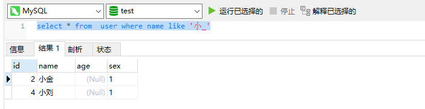
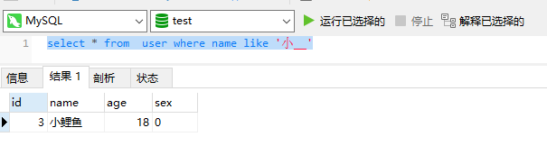
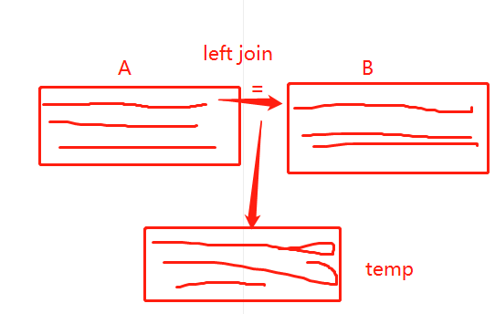

# 	mysql数据库笔记 

## 数据库能干什么🎄

1. 持久化存储数据
2. 备份和恢复数据
3. 快速的存取数据
4. 权限控制

### 存储方式

根据数据存储可分为 `内存存储` 和 `硬盘存储`

## 数据库的类型🎇

### 关系型数据库

#### 特点

​	1：以表和表的关联构成的数据结构

#### 优点

1. 数据持久化存储在硬盘中，能够备份和恢复
2. 能够表达复杂的数据关系
3. 强大的查询语言，能精确查找想要的数据

#### 缺点

1. 针对数据量大的情况，读写性能差
2. 数据结构比较固定

#### 用途

1. 用于存储一些固定的数据，比如文章内容，文章数据等
2. 存储结构复杂·的数据

#### 代表

1. Oracle
2. Mysql
3. SqlServer

### 非关系型数据库

#### 特点

1. 简单的结构存储数据
2. 文档型存储
3. 键值对 `key` `value` 

#### 优点

1. 存储在内存当中，读取数据快
2. 格式灵活

#### 缺点

1. 不能持久化存储数据
2. 对复杂的数据查询效率不好

#### 用途

1. 存储结构简单的数据

#### 代表

1. redis
2. MongDB
3. Membase 

## 数据库的术语🎉

1. DB ： database 数据库
2. DBA  :  database administrator (数据库管理员)
3. DBMS : databasae management system(数据库系统管理员)
4. DBS : database System （数据库系统）

## 数据库的操作🎈

### 主键

​	表中的主键，代表唯一的值，不允许出现重复。

### 外键

​	通常用于关联另外一张表的字段

### 增删改查

#### 增

```sql
-- INSERT INTO `test`.`user` (id,name,age)VALUES(1,"张三" , '18')

-- 带有 default sql  INSERT INTO `test`.`user` (id,name,age)VALUES(2,"小金" ,default) 

INSERT INTO `test`.`user` (id,name,age)VALUES(3,"小金" ,default),(4,"小刘" ,default)
```

#### 删

```sql
DELETE FROM `user` WHERE id = 1
```

#### 改

```sql
update user set age = 18 where id = 3
```

#### 查

```sql
select * from user where id = 1 // 条件查询

select name as n from user // 别名

SELECT case when sex = 1 THEN "男" else '女' end as sex from user4

select * from user where id in （1 , 2）

SELECT * from `user` WHERE  age is null // 查询age为 null 的

select * from  user where name like '%鱼%'

select * from user where name like '张%' and id = 1

select * from  user ORDER BY id ASC 
```

### where

运行机制 ： 运行在 `from`之前

~~~sql
select case when sex = 1 then '男' else '女' end as sex from user  where id = 1
~~~

### distinct

条件 ： 必须出现在 查询 `select `关键字之后。 

~~~sql
SELECT DISTINCT name from user
~~~

### like的用法

`like %A%`

查询关于A字符的所有记录

```sql
select * from  user where name like '%A%'
```

`like %A`

查询以A`结尾`的相关记录

```sql
select * from  user where name like '%A'
```

`like A%`

查询以A%`开头`的相关记录

```sql
select * from  user where name like 'A%'
```

`like A_`
 查询 所有 以A开头的并且是两个字的记录

```sql
select * from  user where name like 'A_'
```





### 升序降序查询

**运行时机** 

>运行在 from 之后 

#### 升序

~~~sql
select * from  user ORDER BY id ASC // 按照id 进行升序排列
~~~

#### 降序

~~~sql
select * from  user ORDER BY id desc // 按照id降序
~~~

#### 多条件排序

多个`降序` or `升序` 条件 

​	当A条件 满足排序是 且条件结果一致时，可以根据 `order by` ,追加排序条件

~~~sql
select * from user order by sex asc, counter desc // 按照 sex 性别进行升序 然后 按照 每个人的 counter降序 处理结果
~~~

## sql中的笛卡尔积🎗

什么是 `笛卡尔积？` 

​	当每一条记录与之对应多条记录产生的结果的总和，即为笛卡尔积。

**sql表示**

~~~sql
select * from employee dept 
~~~

## 表的连接🎢

### left join(左连接)

desc : 以左表为基准，判断每一行数据的关联条件到表中去找，找到了则添加到临时表中。

~~~sql
select  
ep.id as id,
ep.name as name,
ep.location as location,
ep.ismale as ismale,
ep.salary as salary,
ep.deptId as deptId,
ep.joinDate as joinDate,
ep.birthday as birthday
from employee as ep 
LEFT JOIN department as dt on  ep.id = dt.id
~~~




### right join (右连接)

desc : 以右表为基准，判断每一行数据的关联条件到表中去找，找到了则添加到临时表中。

~~~sql
select  
ep.id as id,
ep.name as name,
ep.location as location,
ep.ismale as ismale,
ep.salary as salary,
ep.deptId as deptId,
ep.joinDate as joinDate,
ep.birthday as birthday
from employee as ep 

RIGHT JOIN  department as dt on  ep.id = dt.id
~~~

### inner join （内连接）

~~~sql
select 
e.`name` as name,
case WHEN e.ismale = 1 THEN "男" else "女" END as ismale,
e.joinDate as joinDate,
e.salary as salary,
d.name as deptname,
c.`name` as companyname
from employee as e 
INNER JOIN department as d on e.deptId = d.id 
INNER JOIN company as c on c.id = d.companyId
where c.`name` = '蚂蚁金服' or c.`name` = '腾讯科技'
~~~


## sql练习🎨

1 : **查询user表，得到账号为admin，密码为123456的用户**

~~~sql
select * from user where loginId = 'admin' and password = '123456'
~~~

2 : 查询员工表 ， 按照 员工的入职时间降序排序，并且使用分页查询

~~~sql
select * from employee order by desc limit 10,10
~~~

3：显示出所有员工的姓名、性别(使用男或女显示) 、入职时间、薪水、所属部门(显示部门名称) 、所属公司 (显示公司名称)

~~~sql
select 
e.`name` as name,
case WHEN e.ismale = 1 THEN "男" else "女" END as ismale,
e.joinDate as joinDate,
e.salary as salary,
d.name as deptname,
c.`name` as companyname
from employee as e 
INNER JOIN department as d on e.deptId = d.id 
INNER JOIN company as c on c.id = d.companyId
~~~

4：查询腾讯和蚂蚁金服的所有员工姓名、性别、入职时间、部门名、公司名

~~~sql
 select 
e.`name` as name,
case WHEN e.ismale = 1 THEN "男" else "女" END as ismale,
e.joinDate as joinDate,
d.name as deptname,
c.`name` as companyname
from employee as e 
INNER JOIN department as d on e.deptId = d.id 
INNER JOIN company as c on c.id = d.companyId
where c.`name` = '蚂蚁金服' or c.`name` = '腾讯科技'
~~~

## sql中的函数

### 数学函数

1.  ~~~sql
   select ABS (-1) -- 返回绝对值 
   ~~~

2. ~~~sql
   SELECT CEILING(1.4) -- 向上取整 
   ~~~

3. ~~~sql
   select FLOOR(1.5) -- 向下取整
   ~~~

4. ~~~sql
   select MOD(10,2) --返回取模的余数
   ~~~

5. ~~~sql
   select TRUNCATE(8512.56645,2) --截取小数点后几位
   ~~~

...等等

## sql练习2🎨

1 ： 查询渡一每个部门的员工数量

~~~sql
select d.`name` , COUNT(e.id)as count from employee as e

INNER JOIN  department as d on e.deptId = d.id
INNER JOIN company as c on d.companyId = c.id 

where c.name = '渡一教育'
GROUP BY d.`name`
-- HAVING c.name = '渡一教育'
~~~

2 : 查询每个公司的员工数量

~~~sql
select c.`name` as companyname , COUNT(e.id) as count from employee as e 
INNER JOIN department as d on e.deptId = d.id
INNER JOIN company as c on c.id = d.companyId
GROUP BY c.`name`
~~~

3 : 查询员工人数大于200的公司信息

~~~sql
select c.`name` as companyname , COUNT(e.id) as count from employee as e 
INNER JOIN department as d on e.deptId = d.id
INNER JOIN company as c on c.id = d.companyId
GROUP BY c.`name`
HAVING count > 200
~~~

4 : 查询渡一所有名字为两个字和三个字的员工对应人数

~~~sql
select count(id) as empCount from employee where name like  '__' or  name like  '___' 
~~~

## 数据库 视图

**作用**

视图的作用？ 

​	视图 帮助我们能够将重复的sql进行封装，直接查询视图即可获取结果。

### views

如何创建一个 `视图`？

~~~sql
create view selectEmp as ...
~~~

## mysql2 数据库驱动

### 驱动程序

**什么是驱动程序？**

连接 内存与其他介质的桥梁。

### 创建数据库连接

~~~js
let mysql = require('mysql2');
let connection = mysql.createConnection({
  host     : 'localhost',
  user     : 'root',
  password : 'cjxy200420',
  database : 'stydymysql'
});
~~~

#### 连接到数据库

~~~JavaScript
connection.connect();
~~~

#### 操作数据

~~~javascript
connection.queyy(sql , (er , result) => {
    console.log(result)
})
// connection.end(); 断开数据库连接 
~~~

### 使用mysql2中的promise

`mysql2`支持异步查询，你可以通过`async` and `await` 进行配合使用，以得到最好的同步代码

~~~js
const mysql = require('mysql2/promise')
const connection = mysql.createConnection({
  host : 'localhost',
  port : 3306,
  user : 'root',
  password : 'cjxy200420',
  database : 'stydymysql'
})

async function query(sql ){ 
  return await (await connection).query(sql)
}
async function Main () {
  const [result] = await query('select * from employee limit 10')
  console.log(result);
}
Main()
~~~

`execute` 方法

对指定的`sql`进行预编译，将使用占位进行参数传递

~~~js
async function dbQuery (params) {
  const sql = 'select * from employee where id = ?'
  const res = await (await connection).execute(sql , [params])
  console.log('res' , res);
}	
~~~

### 创建连接池

~~~JavaScript
const mysql = require('mysql2')

const connection = mysql.createPool({
  host : 'localhost',
  port : 3306,
  user : 'root',
  password : 'cjxy200420',
  database : 'stydymys	ql'
})
~~~

## ORM框架

**1 ： Object Relational Mapping （对象关系映射）**

**作用**

1. 通过`ORM`框架，可以自动的把程序中的对象和数据库进行关联，更方便管理
2. `ORM`框架会隐藏具体的数据库底层细节，让开发者使用同样的数据库操作接口，完全对不同的数据库操作

**优势**

1. 开发者不需要关心数据库，只需要关心自己定义的`model`即可生成数据库表字段
2. 可轻易的完成数据库的移植
3. 无需拼接复杂的sql语句即可完成精确查询功能
4. 连接各个数据库，统一内部操作数据，不需要手动写sql，简单高效，可维护性高


